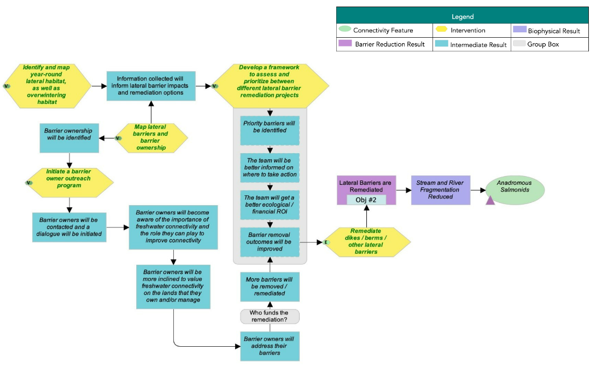
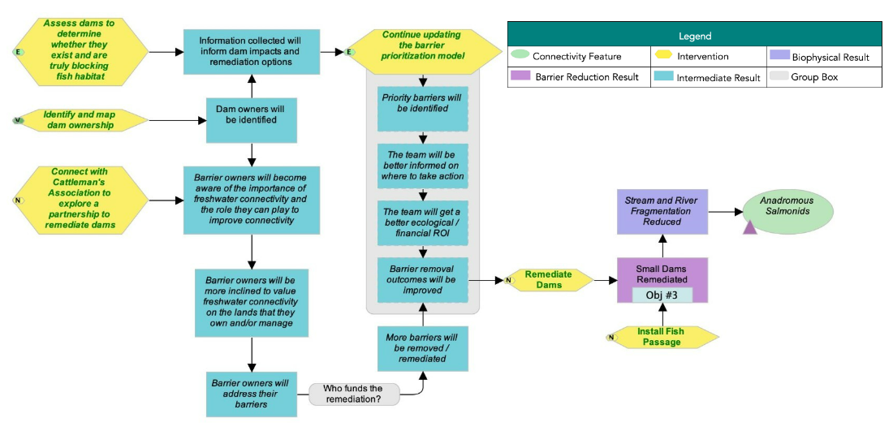
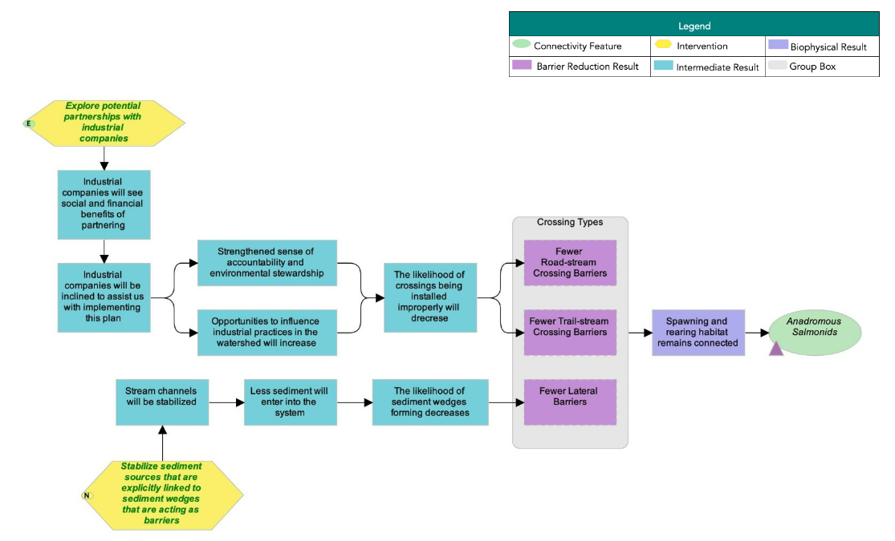

# Supplementary Information {-}

## Situation Analysis {-}

The following situation model was developed by the WCRP planning team to “map” the project context and brainstorm potential actions for implementation. Green text is used to identify actions that were selected for implementation (see Strategies & Actions), and red text is used to identify actions that the project team has decided to exclude from the current iteration of the plan, as they were either outside of the project scope, or were deemed to be ineffective by the planning team. 

{#fig-sitan}

## Strategies & Actions {-}

Effectiveness evaluation of identified conservation strategies and associated actions to improve connectivity for target species in <watershed>. The planning team identified five broad strategies to implement through this WCRP, 1) crossing remediation, 2) lateral barrier remediation, 3) dam remediation, 4) barrier prevention, and 5) communication and education. Individual actions were qualitatively evaluated based on the anticipated effect each action will have on realizing on-the-ground gains in connectivity. Effectiveness ratings are based on a combination of "Feasibility and "Impact", Feasibility is defined as the degree to which the project team can implement the action within realistic constraints (financial, time, ethical, etc.) and Impact is the degree to which the action is likely to contribute to achieving one or more of the goals established in this plan.

## Strategy 1: Crossing Remediation {-}


::: {#tbl-S1 .cell tbl-cap='Strategy 1'}
::: {.cell-output-display}


```{=html}
<style type="text/css">
#T_0a22c th {
  background-color: #008270;
  text-align: left;
}
#T_0a22c_row0_col0, #T_0a22c_row0_col1, #T_0a22c_row0_col2, #T_0a22c_row1_col0, #T_0a22c_row1_col1, #T_0a22c_row1_col2, #T_0a22c_row2_col0, #T_0a22c_row2_col1, #T_0a22c_row2_col2, #T_0a22c_row3_col0, #T_0a22c_row3_col1, #T_0a22c_row3_col2, #T_0a22c_row4_col0, #T_0a22c_row4_col1, #T_0a22c_row4_col2, #T_0a22c_row5_col0, #T_0a22c_row5_col1, #T_0a22c_row5_col2, #T_0a22c_row5_col3, #T_0a22c_row5_col4, #T_0a22c_row5_col5, #T_0a22c_row6_col0, #T_0a22c_row6_col1, #T_0a22c_row6_col2, #T_0a22c_row7_col0, #T_0a22c_row7_col1, #T_0a22c_row7_col2, #T_0a22c_row8_col0, #T_0a22c_row8_col1, #T_0a22c_row8_col2, #T_0a22c_row9_col0, #T_0a22c_row9_col1, #T_0a22c_row9_col2, #T_0a22c_row9_col3, #T_0a22c_row9_col4, #T_0a22c_row9_col5 {
  background-color: white;
  text-align: left;
}
#T_0a22c_row0_col3, #T_0a22c_row0_col5, #T_0a22c_row1_col4, #T_0a22c_row1_col5, #T_0a22c_row3_col4, #T_0a22c_row3_col5, #T_0a22c_row7_col3, #T_0a22c_row7_col4, #T_0a22c_row7_col5 {
  background-color: #03853e;
  text-align: left;
}
#T_0a22c_row0_col4, #T_0a22c_row1_col3, #T_0a22c_row2_col3, #T_0a22c_row2_col4, #T_0a22c_row2_col5, #T_0a22c_row3_col3, #T_0a22c_row4_col3, #T_0a22c_row4_col4, #T_0a22c_row4_col5, #T_0a22c_row6_col3, #T_0a22c_row6_col4, #T_0a22c_row6_col5, #T_0a22c_row8_col3 {
  background-color: #92d050;
  text-align: left;
}
#T_0a22c_row8_col4, #T_0a22c_row8_col5 {
  background-color: #ffff00;
  text-align: left;
}
</style>
<table id="T_0a22c">
  <thead>
    <tr>
      <th id="T_0a22c_level0_col0" class="col_heading level0 col0" >ID</th>
      <th id="T_0a22c_level0_col1" class="col_heading level0 col1" >Actions</th>
      <th id="T_0a22c_level0_col2" class="col_heading level0 col2" >Details</th>
      <th id="T_0a22c_level0_col3" class="col_heading level0 col3" >Feasibility</th>
      <th id="T_0a22c_level0_col4" class="col_heading level0 col4" >Impact</th>
      <th id="T_0a22c_level0_col5" class="col_heading level0 col5" >Effectiveness</th>
    </tr>
  </thead>
  <tbody>
    <tr>
      <td id="T_0a22c_row0_col0" class="data row0 col0" >1.1</td>
      <td id="T_0a22c_row0_col1" class="data row0 col1" >Remediate crossings that are acting as barriers</td>
      <td id="T_0a22c_row0_col2" class="data row0 col2" >This action represents some projects that would be led by the planning team with conservation funds (e.g., orphaned barriers or those owned by individuals), while other remediation projects would be the responsibility of the barrier owner. Industry will have to be engaged to successfully implement this intervention. 

PSC Southern Boundary Restoration and Enhancement Fund proposal:          

-      
 
 Complete remediation of one priority barrier, including engineering designs

HCTF proposal:

- Complete remediation of one priority barrier

CNFASAR proposal (2022-26):

- Complete remediation of one priority barrier per year for four years

HRR Can help with finding local people to implement remediation projects.
</td>
      <td id="T_0a22c_row0_col3" class="data row0 col3" >High</td>
      <td id="T_0a22c_row0_col4" class="data row0 col4" >Very high</td>
      <td id="T_0a22c_row0_col5" class="data row0 col5" >Effective</td>
    </tr>
    <tr>
      <td id="T_0a22c_row1_col0" class="data row1 col0" >1.2</td>
      <td id="T_0a22c_row1_col1" class="data row1 col1" >Lobby that the government enforce their regulations</td>
      <td id="T_0a22c_row1_col2" class="data row1 col2" >This can apply to both provincial and federal governments. For example, advocating for increased discretionary decisions to remove barriers to fish. One action could be to submit barrier assessment data to show proof that regulations are not being followed.</td>
      <td id="T_0a22c_row1_col3" class="data row1 col3" >Very high</td>
      <td id="T_0a22c_row1_col4" class="data row1 col4" >High</td>
      <td id="T_0a22c_row1_col5" class="data row1 col5" >Effective</td>
    </tr>
    <tr>
      <td id="T_0a22c_row2_col0" class="data row2 col0" >1.3</td>
      <td id="T_0a22c_row2_col1" class="data row2 col1" >Initiate a barrier owner outreach program for locations on the barrier remediation shortlist</td>
      <td id="T_0a22c_row2_col2" class="data row2 col2" >Work with landowners / users (e.g., ATV groups) to identify and remediate their aquatic barriers. Education component can help prevent barriers in the first place. HRR to reach out to owners of confirmed barriers to discuss remediation options; CWF to reach out to provincial representatives.</td>
      <td id="T_0a22c_row2_col3" class="data row2 col3" >Very high</td>
      <td id="T_0a22c_row2_col4" class="data row2 col4" >Very high</td>
      <td id="T_0a22c_row2_col5" class="data row2 col5" >Very effective</td>
    </tr>
    <tr>
      <td id="T_0a22c_row3_col0" class="data row3 col0" >1.4</td>
      <td id="T_0a22c_row3_col1" class="data row3 col1" >Knowledge Gap: Continue updating the barrier prioritization model</td>
      <td id="T_0a22c_row3_col2" class="data row3 col2" >The model has been updated to reflect 2021 field assessments and intermediate barrier review.</td>
      <td id="T_0a22c_row3_col3" class="data row3 col3" >Very high</td>
      <td id="T_0a22c_row3_col4" class="data row3 col4" >High</td>
      <td id="T_0a22c_row3_col5" class="data row3 col5" >Effective</td>
    </tr>
    <tr>
      <td id="T_0a22c_row4_col0" class="data row4 col0" >1.5</td>
      <td id="T_0a22c_row4_col1" class="data row4 col1" >Knowledge Gap: conduct field assessments on updated preliminary barrier list using the provincial fish passage framework and update connectivity goal if additional barriers are added to the barrier remediation shortlist</td>
      <td id="T_0a22c_row4_col2" class="data row4 col2" >Twenty-six field assessments performed in 2021.</td>
      <td id="T_0a22c_row4_col3" class="data row4 col3" >Very high</td>
      <td id="T_0a22c_row4_col4" class="data row4 col4" >Very high</td>
      <td id="T_0a22c_row4_col5" class="data row4 col5" >Very effective</td>
    </tr>
    <tr>
      <td id="T_0a22c_row5_col0" class="data row5 col0" >1.6</td>
      <td id="T_0a22c_row5_col1" class="data row5 col1" >Update longitudinal connectivity goal if additional barriers are added to the barrier remediation shortlist</td>
      <td id="T_0a22c_row5_col2" class="data row5 col2" ></td>
      <td id="T_0a22c_row5_col3" class="data row5 col3" ></td>
      <td id="T_0a22c_row5_col4" class="data row5 col4" ></td>
      <td id="T_0a22c_row5_col5" class="data row5 col5" ></td>
    </tr>
    <tr>
      <td id="T_0a22c_row6_col0" class="data row6 col0" >1.7</td>
      <td id="T_0a22c_row6_col1" class="data row6 col1" >Knowledge Gap: Identify and map crossing ownership</td>
      <td id="T_0a22c_row6_col2" class="data row6 col2" >For barriers on the barrier remediation shortlist.</td>
      <td id="T_0a22c_row6_col3" class="data row6 col3" >Very high</td>
      <td id="T_0a22c_row6_col4" class="data row6 col4" >Very high</td>
      <td id="T_0a22c_row6_col5" class="data row6 col5" >Very effective</td>
    </tr>
    <tr>
      <td id="T_0a22c_row7_col0" class="data row7 col0" >1.8</td>
      <td id="T_0a22c_row7_col1" class="data row7 col1" >Knowledge Gap: Compile road maintenance schedules</td>
      <td id="T_0a22c_row7_col2" class="data row7 col2" >Ground-truthing is important, as the schedules do not always reflect what happens in the field.</td>
      <td id="T_0a22c_row7_col3" class="data row7 col3" >High</td>
      <td id="T_0a22c_row7_col4" class="data row7 col4" >High</td>
      <td id="T_0a22c_row7_col5" class="data row7 col5" >Effective</td>
    </tr>
    <tr>
      <td id="T_0a22c_row8_col0" class="data row8 col0" >1.9</td>
      <td id="T_0a22c_row8_col1" class="data row8 col1" >Knowledge Gap: Survey trail-stream crossings to confirm low pressure rating values</td>
      <td id="T_0a22c_row8_col2" class="data row8 col2" >Need to access detailed trail maps in the watershed to prioritize our time and resources. This should be accomplished as people are out surveying for other reasons rather than spending time and resources specifically to fill this knowledge gap.
CNFASAR proposal:
Collaborate with WLFN to:
- Develop field assessment protocols for whether ATV trail stream crossings pass fish, and for assessing other effects on fish habitat 
- Map potential trail-stream crossings on salmon habitat that could be assessed 
- Assess 30-50 trail stream crossings, record measurements, and take pictures</td>
      <td id="T_0a22c_row8_col3" class="data row8 col3" >Very high</td>
      <td id="T_0a22c_row8_col4" class="data row8 col4" >Medium</td>
      <td id="T_0a22c_row8_col5" class="data row8 col5" >Need more information</td>
    </tr>
    <tr>
      <td id="T_0a22c_row9_col0" class="data row9 col0" ></td>
      <td id="T_0a22c_row9_col1" class="data row9 col1" ></td>
      <td id="T_0a22c_row9_col2" class="data row9 col2" ></td>
      <td id="T_0a22c_row9_col3" class="data row9 col3" ></td>
      <td id="T_0a22c_row9_col4" class="data row9 col4" ></td>
      <td id="T_0a22c_row9_col5" class="data row9 col5" ></td>
    </tr>
  </tbody>
</table>

```


:::
:::


## Strategy 2: Lateral Barrier Remediation {-}


::: {#tbl-S2 .cell tbl-cap='Strategy 2'}
::: {.cell-output-display}


```{=html}
<style type="text/css">
#T_af269 th {
  background-color: #008270;
  text-align: left;
}
#T_af269_row0_col0, #T_af269_row0_col1, #T_af269_row0_col2, #T_af269_row1_col0, #T_af269_row1_col1, #T_af269_row1_col2, #T_af269_row2_col0, #T_af269_row2_col1, #T_af269_row2_col2, #T_af269_row3_col0, #T_af269_row3_col1, #T_af269_row3_col2, #T_af269_row4_col0, #T_af269_row4_col1, #T_af269_row4_col2 {
  background-color: white;
  text-align: left;
}
#T_af269_row0_col3, #T_af269_row0_col5 {
  background-color: #03853e;
  text-align: left;
}
#T_af269_row0_col4, #T_af269_row1_col3, #T_af269_row1_col4, #T_af269_row1_col5, #T_af269_row2_col3, #T_af269_row2_col4, #T_af269_row2_col5, #T_af269_row3_col3, #T_af269_row3_col4, #T_af269_row3_col5, #T_af269_row4_col3, #T_af269_row4_col4, #T_af269_row4_col5 {
  background-color: #92d050;
  text-align: left;
}
</style>
<table id="T_af269">
  <thead>
    <tr>
      <th id="T_af269_level0_col0" class="col_heading level0 col0" >ID</th>
      <th id="T_af269_level0_col1" class="col_heading level0 col1" >Actions</th>
      <th id="T_af269_level0_col2" class="col_heading level0 col2" >Details</th>
      <th id="T_af269_level0_col3" class="col_heading level0 col3" >Feasibility</th>
      <th id="T_af269_level0_col4" class="col_heading level0 col4" >Impact</th>
      <th id="T_af269_level0_col5" class="col_heading level0 col5" >Effectiveness</th>
    </tr>
  </thead>
  <tbody>
    <tr>
      <td id="T_af269_row0_col0" class="data row0 col0" >2.1</td>
      <td id="T_af269_row0_col1" class="data row0 col1" >Remediate dikes / berms / other lateral barriers</td>
      <td id="T_af269_row0_col2" class="data row0 col2" ></td>
      <td id="T_af269_row0_col3" class="data row0 col3" >High</td>
      <td id="T_af269_row0_col4" class="data row0 col4" >Very high</td>
      <td id="T_af269_row0_col5" class="data row0 col5" >Effective</td>
    </tr>
    <tr>
      <td id="T_af269_row1_col0" class="data row1 col0" >2.2</td>
      <td id="T_af269_row1_col1" class="data row1 col1" >Initiate a barrier owner outreach program</td>
      <td id="T_af269_row1_col2" class="data row1 col2" ></td>
      <td id="T_af269_row1_col3" class="data row1 col3" >Very high</td>
      <td id="T_af269_row1_col4" class="data row1 col4" >Very high</td>
      <td id="T_af269_row1_col5" class="data row1 col5" >Very effective</td>
    </tr>
    <tr>
      <td id="T_af269_row2_col0" class="data row2 col0" >2.3</td>
      <td id="T_af269_row2_col1" class="data row2 col1" >Knowledge Gap: Identify and map year-round lateral habitat, as well as overwintering habitat</td>
      <td id="T_af269_row2_col2" class="data row2 col2" >Explore the use of a drone to identify lateral habitat.  

- Volunteers from the HRR will conduct field habitat assessments following modules in the Pacific Streamkeepers Handbook to assess disconnected lateral and overwintering salmon habitats in the Horsefly watershed 

CNFASAR proposal:


 -Funding for equipment in 2022-2023, and for field transportation in 2022-2023, 2023-2024</td>
      <td id="T_af269_row2_col3" class="data row2 col3" >Very high</td>
      <td id="T_af269_row2_col4" class="data row2 col4" >Very high</td>
      <td id="T_af269_row2_col5" class="data row2 col5" >Very effective</td>
    </tr>
    <tr>
      <td id="T_af269_row3_col0" class="data row3 col0" >2.4</td>
      <td id="T_af269_row3_col1" class="data row3 col1" >Knowledge Gap: Map lateral barriers and barrier ownership</td>
      <td id="T_af269_row3_col2" class="data row3 col2" >Focus on identifying ownership of priority lateral barriers that we want to remediate in the short-term.</td>
      <td id="T_af269_row3_col3" class="data row3 col3" >Very high</td>
      <td id="T_af269_row3_col4" class="data row3 col4" >Very high</td>
      <td id="T_af269_row3_col5" class="data row3 col5" >Very effective</td>
    </tr>
    <tr>
      <td id="T_af269_row4_col0" class="data row4 col0" >2.5</td>
      <td id="T_af269_row4_col1" class="data row4 col1" >Knowledge Gap: Develop a framework to assess and prioritize between different lateral barrier remediation projects</td>
      <td id="T_af269_row4_col2" class="data row4 col2" >CWF is leading a provincial-scale analysis of the effect of rail lines on connectivity for Anadromous Salmonids, as part of this project lateral habitat and barrier assessments and prioritization methods will be developed.</td>
      <td id="T_af269_row4_col3" class="data row4 col3" >Very high</td>
      <td id="T_af269_row4_col4" class="data row4 col4" >Very high</td>
      <td id="T_af269_row4_col5" class="data row4 col5" >Very effective</td>
    </tr>
  </tbody>
</table>

```


:::
:::


## Strategy 3: Dam Remediation {-}


::: {#tbl-S3 .cell tbl-cap='Strategy 3'}
::: {.cell-output-display}


```{=html}
<style type="text/css">
#T_dfb7b th {
  background-color: #008270;
  text-align: left;
}
#T_dfb7b_row0_col0, #T_dfb7b_row0_col1, #T_dfb7b_row0_col2, #T_dfb7b_row1_col0, #T_dfb7b_row1_col1, #T_dfb7b_row1_col2, #T_dfb7b_row2_col0, #T_dfb7b_row2_col1, #T_dfb7b_row2_col2, #T_dfb7b_row3_col0, #T_dfb7b_row3_col1, #T_dfb7b_row3_col2, #T_dfb7b_row4_col0, #T_dfb7b_row4_col1, #T_dfb7b_row4_col2, #T_dfb7b_row5_col0, #T_dfb7b_row5_col1, #T_dfb7b_row5_col2 {
  background-color: white;
  text-align: left;
}
#T_dfb7b_row0_col3, #T_dfb7b_row0_col5, #T_dfb7b_row1_col3, #T_dfb7b_row1_col5, #T_dfb7b_row2_col4, #T_dfb7b_row2_col5 {
  background-color: #ffff00;
  text-align: left;
}
#T_dfb7b_row0_col4, #T_dfb7b_row3_col3, #T_dfb7b_row4_col3, #T_dfb7b_row5_col3, #T_dfb7b_row5_col4, #T_dfb7b_row5_col5 {
  background-color: #92d050;
  text-align: left;
}
#T_dfb7b_row1_col4, #T_dfb7b_row2_col3, #T_dfb7b_row3_col4, #T_dfb7b_row3_col5, #T_dfb7b_row4_col4, #T_dfb7b_row4_col5 {
  background-color: #03853e;
  text-align: left;
}
</style>
<table id="T_dfb7b">
  <thead>
    <tr>
      <th id="T_dfb7b_level0_col0" class="col_heading level0 col0" >ID</th>
      <th id="T_dfb7b_level0_col1" class="col_heading level0 col1" >Actions</th>
      <th id="T_dfb7b_level0_col2" class="col_heading level0 col2" >Details</th>
      <th id="T_dfb7b_level0_col3" class="col_heading level0 col3" >Feasibility</th>
      <th id="T_dfb7b_level0_col4" class="col_heading level0 col4" >Impact</th>
      <th id="T_dfb7b_level0_col5" class="col_heading level0 col5" >Effectiveness</th>
    </tr>
  </thead>
  <tbody>
    <tr>
      <td id="T_dfb7b_row0_col0" class="data row0 col0" >3.1</td>
      <td id="T_dfb7b_row0_col1" class="data row0 col1" >Remediate Dams</td>
      <td id="T_dfb7b_row0_col2" class="data row0 col2" ></td>
      <td id="T_dfb7b_row0_col3" class="data row0 col3" >Medium</td>
      <td id="T_dfb7b_row0_col4" class="data row0 col4" >Very high</td>
      <td id="T_dfb7b_row0_col5" class="data row0 col5" >Need more information</td>
    </tr>
    <tr>
      <td id="T_dfb7b_row1_col0" class="data row1 col0" >3.2</td>
      <td id="T_dfb7b_row1_col1" class="data row1 col1" >Install Fish Passage</td>
      <td id="T_dfb7b_row1_col2" class="data row1 col2" ></td>
      <td id="T_dfb7b_row1_col3" class="data row1 col3" >Medium</td>
      <td id="T_dfb7b_row1_col4" class="data row1 col4" >High</td>
      <td id="T_dfb7b_row1_col5" class="data row1 col5" >Need more information</td>
    </tr>
    <tr>
      <td id="T_dfb7b_row2_col0" class="data row2 col0" >3.3</td>
      <td id="T_dfb7b_row2_col1" class="data row2 col1" >Connect with Cattleman's Association to explore a partnership to remediate dams</td>
      <td id="T_dfb7b_row2_col2" class="data row2 col2" >This may involve exploring alternative water management actions that would allow for the remediation of irrigation dams.</td>
      <td id="T_dfb7b_row2_col3" class="data row2 col3" >High</td>
      <td id="T_dfb7b_row2_col4" class="data row2 col4" >Medium</td>
      <td id="T_dfb7b_row2_col5" class="data row2 col5" >Need more information</td>
    </tr>
    <tr>
      <td id="T_dfb7b_row3_col0" class="data row3 col0" >3.4</td>
      <td id="T_dfb7b_row3_col1" class="data row3 col1" >Knowledge Gap: Continue updating the barrier prioritization model</td>
      <td id="T_dfb7b_row3_col2" class="data row3 col2" >The model has been updated to reflect 2021 field assessments and intermediate barrier review.</td>
      <td id="T_dfb7b_row3_col3" class="data row3 col3" >Very high</td>
      <td id="T_dfb7b_row3_col4" class="data row3 col4" >High</td>
      <td id="T_dfb7b_row3_col5" class="data row3 col5" >Effective</td>
    </tr>
    <tr>
      <td id="T_dfb7b_row4_col0" class="data row4 col0" >3.5</td>
      <td id="T_dfb7b_row4_col1" class="data row4 col1" >Knowledge Gap: Assess dams to determine whether they exist and are truly blocking fish habitat</td>
      <td id="T_dfb7b_row4_col2" class="data row4 col2" >Four dams were assessed during 2021 field season; additional field assessment needed.</td>
      <td id="T_dfb7b_row4_col3" class="data row4 col3" >Very high</td>
      <td id="T_dfb7b_row4_col4" class="data row4 col4" >High</td>
      <td id="T_dfb7b_row4_col5" class="data row4 col5" >Effective</td>
    </tr>
    <tr>
      <td id="T_dfb7b_row5_col0" class="data row5 col0" >3.6</td>
      <td id="T_dfb7b_row5_col1" class="data row5 col1" >Knowledge Gap: Identify and map dam ownership</td>
      <td id="T_dfb7b_row5_col2" class="data row5 col2" ></td>
      <td id="T_dfb7b_row5_col3" class="data row5 col3" >Very high</td>
      <td id="T_dfb7b_row5_col4" class="data row5 col4" >Very high</td>
      <td id="T_dfb7b_row5_col5" class="data row5 col5" >Very effective</td>
    </tr>
  </tbody>
</table>

```


:::
:::


## Strategy 4: Barrier Prevention {-}


::: {#tbl-S4 .cell tbl-cap='Strategy 4'}
::: {.cell-output-display}


```{=html}
<style type="text/css">
#T_ef074 th {
  background-color: #008270;
  text-align: left;
}
#T_ef074_row0_col0, #T_ef074_row0_col1, #T_ef074_row0_col2, #T_ef074_row1_col0, #T_ef074_row1_col1, #T_ef074_row1_col2 {
  background-color: white;
  text-align: left;
}
#T_ef074_row0_col3, #T_ef074_row1_col3 {
  background-color: #92d050;
  text-align: left;
}
#T_ef074_row0_col4, #T_ef074_row0_col5 {
  background-color: #03853e;
  text-align: left;
}
#T_ef074_row1_col4, #T_ef074_row1_col5 {
  background-color: #ffff00;
  text-align: left;
}
</style>
<table id="T_ef074">
  <thead>
    <tr>
      <th id="T_ef074_level0_col0" class="col_heading level0 col0" >ID</th>
      <th id="T_ef074_level0_col1" class="col_heading level0 col1" >Actions</th>
      <th id="T_ef074_level0_col2" class="col_heading level0 col2" >Details</th>
      <th id="T_ef074_level0_col3" class="col_heading level0 col3" >Feasibility</th>
      <th id="T_ef074_level0_col4" class="col_heading level0 col4" >Impact</th>
      <th id="T_ef074_level0_col5" class="col_heading level0 col5" >Effectiveness</th>
    </tr>
  </thead>
  <tbody>
    <tr>
      <td id="T_ef074_row0_col0" class="data row0 col0" >4.1</td>
      <td id="T_ef074_row0_col1" class="data row0 col1" >Explore potential partnerships with industrial companies</td>
      <td id="T_ef074_row0_col2" class="data row0 col2" >Invite industrial players to a workshop on how to apply crossing / lateral barrier BMPs. BMPs could include those that minimize the need for road-stream crossings.</td>
      <td id="T_ef074_row0_col3" class="data row0 col3" >Very high</td>
      <td id="T_ef074_row0_col4" class="data row0 col4" >High</td>
      <td id="T_ef074_row0_col5" class="data row0 col5" >Effective</td>
    </tr>
    <tr>
      <td id="T_ef074_row1_col0" class="data row1 col0" >4.2</td>
      <td id="T_ef074_row1_col1" class="data row1 col1" >Stabilize sediment sources that are explicitly linked to sediment wedges or erosion that are acting as barriers</td>
      <td id="T_ef074_row1_col2" class="data row1 col2" >This could include numerous bank stabilization techniques, including restoring riparian vegetation. This applies to some tributaries that have altered confluence areas - the link needs to be made between confluence alterations and timing of movement for juvenile fish. Local ranchers and Cattleman's association could be engaged, as well as forestry licensees.</td>
      <td id="T_ef074_row1_col3" class="data row1 col3" >Very high</td>
      <td id="T_ef074_row1_col4" class="data row1 col4" >Medium</td>
      <td id="T_ef074_row1_col5" class="data row1 col5" >Need more information</td>
    </tr>
  </tbody>
</table>

```


:::
:::


## Strategy 5: Communication and Education {-}


::: {#tbl-S5 .cell tbl-cap='Strategy 5'}
::: {.cell-output-display}


```{=html}
<style type="text/css">
#T_ac843 th {
  background-color: #008270;
  text-align: left;
}
#T_ac843_row0_col0, #T_ac843_row0_col1, #T_ac843_row0_col2, #T_ac843_row1_col0, #T_ac843_row1_col1, #T_ac843_row1_col2 {
  background-color: white;
  text-align: left;
}
</style>
<table id="T_ac843">
  <thead>
    <tr>
      <th id="T_ac843_level0_col0" class="col_heading level0 col0" >ID</th>
      <th id="T_ac843_level0_col1" class="col_heading level0 col1" >Actions</th>
      <th id="T_ac843_level0_col2" class="col_heading level0 col2" >Details</th>
    </tr>
  </thead>
  <tbody>
    <tr>
      <td id="T_ac843_row0_col0" class="data row0 col0" >5.1</td>
      <td id="T_ac843_row0_col1" class="data row0 col1" >Implement the WCRP Progress Tracking Plan</td>
      <td id="T_ac843_row0_col2" class="data row0 col2" >The WCRP Progress Tracking Plan will help the team determine if we are achieving our goals and objectives.</td>
    </tr>
    <tr>
      <td id="T_ac843_row1_col0" class="data row1 col0" >5.2</td>
      <td id="T_ac843_row1_col1" class="data row1 col1" >Develop a communication strategy to raise awareness and support for this WCRP</td>
      <td id="T_ac843_row1_col2" class="data row1 col2" >This intervention includes communicating both the WCRP and the collaborative process in developing it, as well as communicating outcomes (e.g., barrier remediations). CNFASAR proposal:
- HRR will work with CWF to develop outreach and communications materials, including press releases, social media content, a video, and content for their website
- With HRR, CWF will present on fish passage issues and solutions at the annual Horsefly River Salmon Festival</td>
    </tr>
  </tbody>
</table>

```


:::
:::


## Theories of Change & Objectives {-}

Theories of Change are explicit assumptions around how the identified actions will achieve gains in connectivity and contribute towards reaching the goals of the plan. To develop Theories of Change, the planning team developed explicit assumptions for each strategy which helped to clarify the rationale used for undertaking actions and provided an opportunity for feedback on invalid assumptions or missing opportunities. The Theories of Change are results oriented and clearly define the expected outcome. The following theory of change models were developed by the WCRP planning team to “map” the causal (“if-then”) progression of assumptions of how the actions within a strategy work together to achieve project goals. 

{#fig-stra1}

{#fig-stra2}

{#fig-stra3}

{#fig-stra4}

## Operational Plan {-}

The operational plan represents a preliminary exercise undertaken by the planning team to identify the potential leads, potential participants, and estimated cost for the implementation of each action in <watershed>. The table below summarizes individuals, groups, or organizations that the planning team felt could lead or participate in the implementation of the plan and should be interpreted as the first step in on-going planning and engagement to develop more detailed and sophisticated action plans for each entry in the table. The individuals, groups, and organizations listed under the "Lead(s)" or "Potential Participants" columns are those that provisionally expressed interest in participating in one of those roles or were suggested by the planning team for further engagement (denoted in bold), for those that are not members of the planning team. The leads, participants, and estimated costs in the operational plan are not binding nor an official commitment of resources, but rather provide a roadmap for future coordination and engagement to work towards implementation of the WCRP.


::: {#tbl-opplan .cell tbl-cap='Operational plan to support the implementation of strategies and actions to improve connectivity for target species in <watershed>.'}
::: {.cell-output-display}


```{=html}
<style type="text/css">
#T_89173 th {
  background-color: #008270;
  text-align: left;
}
#T_89173_row0_col0, #T_89173_row0_col1, #T_89173_row0_col2, #T_89173_row0_col3, #T_89173_row10_col0, #T_89173_row10_col1, #T_89173_row10_col2, #T_89173_row10_col3, #T_89173_row16_col0, #T_89173_row16_col1, #T_89173_row16_col2, #T_89173_row16_col3, #T_89173_row23_col0, #T_89173_row23_col1, #T_89173_row23_col2, #T_89173_row23_col3, #T_89173_row26_col0, #T_89173_row26_col1, #T_89173_row26_col2, #T_89173_row26_col3, #T_89173_row29_col0, #T_89173_row29_col1, #T_89173_row29_col2, #T_89173_row29_col3, #T_89173_row30_col0, #T_89173_row30_col1, #T_89173_row30_col2, #T_89173_row30_col3, #T_89173_row31_col0, #T_89173_row31_col1, #T_89173_row31_col2, #T_89173_row31_col3 {
  background-color: black;
  color: white;
  text-align: left;
}
#T_89173_row1_col0, #T_89173_row1_col1, #T_89173_row1_col2, #T_89173_row1_col3, #T_89173_row2_col0, #T_89173_row2_col1, #T_89173_row2_col2, #T_89173_row2_col3, #T_89173_row3_col0, #T_89173_row3_col1, #T_89173_row3_col2, #T_89173_row3_col3, #T_89173_row4_col0, #T_89173_row4_col1, #T_89173_row4_col2, #T_89173_row4_col3, #T_89173_row5_col0, #T_89173_row5_col1, #T_89173_row5_col2, #T_89173_row5_col3, #T_89173_row6_col0, #T_89173_row6_col1, #T_89173_row6_col2, #T_89173_row6_col3, #T_89173_row7_col0, #T_89173_row7_col1, #T_89173_row7_col2, #T_89173_row7_col3, #T_89173_row8_col0, #T_89173_row8_col1, #T_89173_row8_col2, #T_89173_row8_col3, #T_89173_row9_col0, #T_89173_row9_col1, #T_89173_row9_col2, #T_89173_row9_col3, #T_89173_row11_col0, #T_89173_row11_col1, #T_89173_row11_col2, #T_89173_row11_col3, #T_89173_row12_col0, #T_89173_row12_col1, #T_89173_row12_col2, #T_89173_row12_col3, #T_89173_row13_col0, #T_89173_row13_col1, #T_89173_row13_col2, #T_89173_row13_col3, #T_89173_row14_col0, #T_89173_row14_col1, #T_89173_row14_col2, #T_89173_row14_col3, #T_89173_row15_col0, #T_89173_row15_col1, #T_89173_row15_col2, #T_89173_row15_col3, #T_89173_row17_col0, #T_89173_row17_col1, #T_89173_row17_col2, #T_89173_row17_col3, #T_89173_row18_col0, #T_89173_row18_col1, #T_89173_row18_col2, #T_89173_row18_col3, #T_89173_row19_col0, #T_89173_row19_col1, #T_89173_row19_col2, #T_89173_row19_col3, #T_89173_row20_col0, #T_89173_row20_col1, #T_89173_row20_col2, #T_89173_row20_col3, #T_89173_row21_col0, #T_89173_row21_col1, #T_89173_row21_col2, #T_89173_row21_col3, #T_89173_row22_col0, #T_89173_row22_col1, #T_89173_row22_col2, #T_89173_row22_col3, #T_89173_row24_col0, #T_89173_row24_col1, #T_89173_row24_col2, #T_89173_row24_col3, #T_89173_row25_col0, #T_89173_row25_col1, #T_89173_row25_col2, #T_89173_row25_col3, #T_89173_row27_col0, #T_89173_row27_col1, #T_89173_row27_col2, #T_89173_row27_col3, #T_89173_row28_col0, #T_89173_row28_col1, #T_89173_row28_col2, #T_89173_row28_col3 {
  text-align: left;
}
</style>
<table id="T_89173">
  <thead>
    <tr>
      <th id="T_89173_level0_col0" class="col_heading level0 col0" >Strategy / Actions</th>
      <th id="T_89173_level0_col1" class="col_heading level0 col1" >Lead(s) [1]</th>
      <th id="T_89173_level0_col2" class="col_heading level0 col2" >Participants3</th>
      <th id="T_89173_level0_col3" class="col_heading level0 col3" >Total Budget</th>
    </tr>
  </thead>
  <tbody>
    <tr>
      <td id="T_89173_row0_col0" class="data row0 col0" >Strategy 1: Crossing Remediation</td>
      <td id="T_89173_row0_col1" class="data row0 col1" ></td>
      <td id="T_89173_row0_col2" class="data row0 col2" ></td>
      <td id="T_89173_row0_col3" class="data row0 col3" >$3,666,300.00 </td>
    </tr>
    <tr>
      <td id="T_89173_row1_col0" class="data row1 col0" >1.1 – Remediate crossings that are acting as barriers </td>
      <td id="T_89173_row1_col1" class="data row1 col1" >CWF</td>
      <td id="T_89173_row1_col2" class="data row1 col2" >Horsefly River Roundtable, Fisheries and Oceans Canada (DFO)</td>
      <td id="T_89173_row1_col3" class="data row1 col3" >$3,500,000.00 </td>
    </tr>
    <tr>
      <td id="T_89173_row2_col0" class="data row2 col0" >1.2 – Lobby that the government enforce their regulations</td>
      <td id="T_89173_row2_col1" class="data row2 col1" >TBD</td>
      <td id="T_89173_row2_col2" class="data row2 col2" >CWF, Horsefly River Roundtable, Williams Lake First Nation (WLFN)</td>
      <td id="T_89173_row2_col3" class="data row2 col3" >$10,000.00 </td>
    </tr>
    <tr>
      <td id="T_89173_row3_col0" class="data row3 col0" >1.3 – Initiate a barrier owner outreach program for locations on the barrier remediation shortlist</td>
      <td id="T_89173_row3_col1" class="data row3 col1" >HRR, CWF, DFO</td>
      <td id="T_89173_row3_col2" class="data row3 col2" ></td>
      <td id="T_89173_row3_col3" class="data row3 col3" >TBD</td>
    </tr>
    <tr>
      <td id="T_89173_row4_col0" class="data row4 col0" >1.4 – Knowledge Gap: Continue updating the barrier prioritization model</td>
      <td id="T_89173_row4_col1" class="data row4 col1" >CWF</td>
      <td id="T_89173_row4_col2" class="data row4 col2" >TBD</td>
      <td id="T_89173_row4_col3" class="data row4 col3" >$100,000.00 </td>
    </tr>
    <tr>
      <td id="T_89173_row5_col0" class="data row5 col0" >1.5 – Knowledge Gap: conduct field assessments on updated preliminary barrier list using the provincial fish passage framework and update connectivity goal if additional barriers are added to the barrier remediation shortlist</td>
      <td id="T_89173_row5_col1" class="data row5 col1" >CWF</td>
      <td id="T_89173_row5_col2" class="data row5 col2" >Horsefly River Roundtable, DFO</td>
      <td id="T_89173_row5_col3" class="data row5 col3" >$50,300.00 </td>
    </tr>
    <tr>
      <td id="T_89173_row6_col0" class="data row6 col0" >1.6 - Update longitudinal connectivity goal if additional barriers are added to the barrier remediation shortlist</td>
      <td id="T_89173_row6_col1" class="data row6 col1" ></td>
      <td id="T_89173_row6_col2" class="data row6 col2" ></td>
      <td id="T_89173_row6_col3" class="data row6 col3" ></td>
    </tr>
    <tr>
      <td id="T_89173_row7_col0" class="data row7 col0" >1.7 – Knowledge Gap: Identify and map crossing ownership for barriers on the barrier remediation shortlist</td>
      <td id="T_89173_row7_col1" class="data row7 col1" >TBD</td>
      <td id="T_89173_row7_col2" class="data row7 col2" >CWF, DFO (Anthonie)</td>
      <td id="T_89173_row7_col3" class="data row7 col3" >$1,500.00 </td>
    </tr>
    <tr>
      <td id="T_89173_row8_col0" class="data row8 col0" >1.8 – Knowledge Gap: Compile road maintenance schedules</td>
      <td id="T_89173_row8_col1" class="data row8 col1" >DFO</td>
      <td id="T_89173_row8_col2" class="data row8 col2" >CWF, WLFN, DFO, FLNRORD</td>
      <td id="T_89173_row8_col3" class="data row8 col3" >$2,000.00 </td>
    </tr>
    <tr>
      <td id="T_89173_row9_col0" class="data row9 col0" >1.9 – Knowledge Gap: Survey trail-stream crossings to confirm low pressure rating values</td>
      <td id="T_89173_row9_col1" class="data row9 col1" >WLFN</td>
      <td id="T_89173_row9_col2" class="data row9 col2" >CWF, DFO</td>
      <td id="T_89173_row9_col3" class="data row9 col3" >$2,500.00 </td>
    </tr>
    <tr>
      <td id="T_89173_row10_col0" class="data row10 col0" >Strategy 2: Lateral Barrier Remediation</td>
      <td id="T_89173_row10_col1" class="data row10 col1" ></td>
      <td id="T_89173_row10_col2" class="data row10 col2" ></td>
      <td id="T_89173_row10_col3" class="data row10 col3" >$80,000.00 </td>
    </tr>
    <tr>
      <td id="T_89173_row11_col0" class="data row11 col0" >2.1 – Remediate dikes / berms / other structures that are acting as barriers</td>
      <td id="T_89173_row11_col1" class="data row11 col1" >CWF</td>
      <td id="T_89173_row11_col2" class="data row11 col2" >DFO, Horsefly River Roundtable</td>
      <td id="T_89173_row11_col3" class="data row11 col3" >TBD</td>
    </tr>
    <tr>
      <td id="T_89173_row12_col0" class="data row12 col0" >2.2 – Initiate a barrier owner outreach program </td>
      <td id="T_89173_row12_col1" class="data row12 col1" >TBD</td>
      <td id="T_89173_row12_col2" class="data row12 col2" >CWF, DFO</td>
      <td id="T_89173_row12_col3" class="data row12 col3" >TBD</td>
    </tr>
    <tr>
      <td id="T_89173_row13_col0" class="data row13 col0" >2.3 – Knowledge Gap: Identify and map year-round lateral habitat, as well as overwintering habitat</td>
      <td id="T_89173_row13_col1" class="data row13 col1" >Horsefly River Roundtable, DFO</td>
      <td id="T_89173_row13_col2" class="data row13 col2" >CWF, Northern Shuswap Tribal Council (NSTC), WLFN</td>
      <td id="T_89173_row13_col3" class="data row13 col3" >$65,000.00 </td>
    </tr>
    <tr>
      <td id="T_89173_row14_col0" class="data row14 col0" >2.4 – Knowledge Gap: Map lateral barriers and barrier ownership</td>
      <td id="T_89173_row14_col1" class="data row14 col1" >CWF</td>
      <td id="T_89173_row14_col2" class="data row14 col2" >DFO, Horsefly River Roundtable</td>
      <td id="T_89173_row14_col3" class="data row14 col3" >$5,000.00 </td>
    </tr>
    <tr>
      <td id="T_89173_row15_col0" class="data row15 col0" >2.5 – Knowledge Gap: Develop a framework to assess and prioritize between different lateral barrier remediation projects</td>
      <td id="T_89173_row15_col1" class="data row15 col1" >CWF</td>
      <td id="T_89173_row15_col2" class="data row15 col2" >DFO</td>
      <td id="T_89173_row15_col3" class="data row15 col3" >$10,000.00 </td>
    </tr>
    <tr>
      <td id="T_89173_row16_col0" class="data row16 col0" >Strategy 3: Dam Remediation</td>
      <td id="T_89173_row16_col1" class="data row16 col1" ></td>
      <td id="T_89173_row16_col2" class="data row16 col2" ></td>
      <td id="T_89173_row16_col3" class="data row16 col3" >$1,305,000.00 </td>
    </tr>
    <tr>
      <td id="T_89173_row17_col0" class="data row17 col0" >3.1 - Remediate Dams</td>
      <td id="T_89173_row17_col1" class="data row17 col1" >TBD</td>
      <td id="T_89173_row17_col2" class="data row17 col2" >TBD</td>
      <td id="T_89173_row17_col3" class="data row17 col3" >$1,305,000.00 </td>
    </tr>
    <tr>
      <td id="T_89173_row18_col0" class="data row18 col0" >3.2 - Install Fish Passage</td>
      <td id="T_89173_row18_col1" class="data row18 col1" >TBD</td>
      <td id="T_89173_row18_col2" class="data row18 col2" >TBD</td>
      <td id="T_89173_row18_col3" class="data row18 col3" >TBD</td>
    </tr>
    <tr>
      <td id="T_89173_row19_col0" class="data row19 col0" >3.3 - Connect with Cattleman's Association to explore a partnership to remediate dams</td>
      <td id="T_89173_row19_col1" class="data row19 col1" >TBD</td>
      <td id="T_89173_row19_col2" class="data row19 col2" >TBD</td>
      <td id="T_89173_row19_col3" class="data row19 col3" >TBD</td>
    </tr>
    <tr>
      <td id="T_89173_row20_col0" class="data row20 col0" >3.4 - Knowledge Gap: Continue updating the barrier prioritization model</td>
      <td id="T_89173_row20_col1" class="data row20 col1" >CWF</td>
      <td id="T_89173_row20_col2" class="data row20 col2" >TBD</td>
      <td id="T_89173_row20_col3" class="data row20 col3" >$0.00 </td>
    </tr>
    <tr>
      <td id="T_89173_row21_col0" class="data row21 col0" >3.5 - Knowledge Gap: Assess dams to determine whether they exist and are truly blocking salmon habitat</td>
      <td id="T_89173_row21_col1" class="data row21 col1" >HRR(?) DFO(?) CWF(?)</td>
      <td id="T_89173_row21_col2" class="data row21 col2" >TBD</td>
      <td id="T_89173_row21_col3" class="data row21 col3" >TBD</td>
    </tr>
    <tr>
      <td id="T_89173_row22_col0" class="data row22 col0" >3.6 - Knowledge Gap: Identify and map dam ownership</td>
      <td id="T_89173_row22_col1" class="data row22 col1" >TBD</td>
      <td id="T_89173_row22_col2" class="data row22 col2" >TBD</td>
      <td id="T_89173_row22_col3" class="data row22 col3" >TBD</td>
    </tr>
    <tr>
      <td id="T_89173_row23_col0" class="data row23 col0" >Strategy 4: Barrier Prevention</td>
      <td id="T_89173_row23_col1" class="data row23 col1" ></td>
      <td id="T_89173_row23_col2" class="data row23 col2" ></td>
      <td id="T_89173_row23_col3" class="data row23 col3" >$110,000.00 </td>
    </tr>
    <tr>
      <td id="T_89173_row24_col0" class="data row24 col0" >4.1 – Explore potential partnerships with industrial companies</td>
      <td id="T_89173_row24_col1" class="data row24 col1" >TBD</td>
      <td id="T_89173_row24_col2" class="data row24 col2" >CWF, DFO, Horsefly River Roundtable, WLFN</td>
      <td id="T_89173_row24_col3" class="data row24 col3" >$10,000.00 </td>
    </tr>
    <tr>
      <td id="T_89173_row25_col0" class="data row25 col0" >4.2 – Stabilize sediment sources that are explicitly linked to sediment wedges or erosion that are acting as barriers </td>
      <td id="T_89173_row25_col1" class="data row25 col1" >TBD</td>
      <td id="T_89173_row25_col2" class="data row25 col2" >DFO</td>
      <td id="T_89173_row25_col3" class="data row25 col3" >$100,000.00 </td>
    </tr>
    <tr>
      <td id="T_89173_row26_col0" class="data row26 col0" >Strategy 5: Progress Tracking Plan</td>
      <td id="T_89173_row26_col1" class="data row26 col1" ></td>
      <td id="T_89173_row26_col2" class="data row26 col2" ></td>
      <td id="T_89173_row26_col3" class="data row26 col3" >TBD</td>
    </tr>
    <tr>
      <td id="T_89173_row27_col0" class="data row27 col0" >5.1 - Implement the WCRP Progress Tracking Plan</td>
      <td id="T_89173_row27_col1" class="data row27 col1" >CWF</td>
      <td id="T_89173_row27_col2" class="data row27 col2" ></td>
      <td id="T_89173_row27_col3" class="data row27 col3" >TBD</td>
    </tr>
    <tr>
      <td id="T_89173_row28_col0" class="data row28 col0" >5.2 - Develop a communication action to raise awareness and support for this WCRP</td>
      <td id="T_89173_row28_col1" class="data row28 col1" >CWF, HRR</td>
      <td id="T_89173_row28_col2" class="data row28 col2" >TBD</td>
      <td id="T_89173_row28_col3" class="data row28 col3" >TBD</td>
    </tr>
    <tr>
      <td id="T_89173_row29_col0" class="data row29 col0" >Total:</td>
      <td id="T_89173_row29_col1" class="data row29 col1" ></td>
      <td id="T_89173_row29_col2" class="data row29 col2" ></td>
      <td id="T_89173_row29_col3" class="data row29 col3" >$5,161,300.00 </td>
    </tr>
    <tr>
      <td id="T_89173_row30_col0" class="data row30 col0" >Fundraising total:</td>
      <td id="T_89173_row30_col1" class="data row30 col1" ></td>
      <td id="T_89173_row30_col2" class="data row30 col2" ></td>
      <td id="T_89173_row30_col3" class="data row30 col3" >$2,508,800 </td>
    </tr>
    <tr>
      <td id="T_89173_row31_col0" class="data row31 col0" >Proponent/government contribution total:</td>
      <td id="T_89173_row31_col1" class="data row31 col1" ></td>
      <td id="T_89173_row31_col2" class="data row31 col2" ></td>
      <td id="T_89173_row31_col3" class="data row31 col3" >$2,652,500 </td>
    </tr>
  </tbody>
</table>

```


:::
:::


## Funding Sources {-}


::: {#tbl-fund .cell tbl-cap='Potential funding sources for plan implementation in <watershed>. The Canadian Wildlife Federation and the planning team can coordinate proposal submission through these sources.'}


``````{=openxml}

<w:tbl xmlns:w="http://schemas.openxmlformats.org/wordprocessingml/2006/main" xmlns:r="http://schemas.openxmlformats.org/officeDocument/2006/relationships" xmlns:w14="http://schemas.microsoft.com/office/word/2010/wordml" xmlns:wp="http://schemas.openxmlformats.org/drawingml/2006/wordprocessingDrawing" xmlns:a="http://schemas.openxmlformats.org/drawingml/2006/main" xmlns:pic="http://schemas.openxmlformats.org/drawingml/2006/picture"><w:tblPr><w:tblLayout w:type="fixed"/><w:jc w:val="center"/><w:tblLook w:firstRow="1" w:lastRow="0" w:firstColumn="0" w:lastColumn="0" w:noHBand="0" w:noVBand="1"/></w:tblPr><w:tblGrid><w:gridCol w:w="7944"/><w:gridCol w:w="86804"/></w:tblGrid><w:tr><w:trPr><w:trHeight w:val="617" w:hRule="auto"/><w:tblHeader/></w:trPr>header 1<w:tc><w:tcPr><w:tcBorders><w:bottom w:val="single" w:sz="12" w:space="0" w:color="666666"/><w:top w:val="single" w:sz="12" w:space="0" w:color="666666"/><w:left w:val="none" w:sz="0" w:space="0" w:color="000000"/><w:right w:val="none" w:sz="0" w:space="0" w:color="000000"/></w:tcBorders><w:shd w:val="clear" w:color="auto" w:fill="008270"/><w:tcMar><w:top w:w="0" w:type="dxa"/><w:bottom w:w="0" w:type="dxa"/><w:left w:w="0" w:type="dxa"/><w:right w:w="0" w:type="dxa"/></w:tcMar><w:vAlign w:val="center"/></w:tcPr><w:p><w:pPr><w:pStyle w:val="Normal"/><w:jc w:val="left"/><w:pBdr><w:bottom w:val="none" w:sz="0" w:space="0" w:color="000000"/><w:top w:val="none" w:sz="0" w:space="0" w:color="000000"/><w:left w:val="none" w:sz="0" w:space="0" w:color="000000"/><w:right w:val="none" w:sz="0" w:space="0" w:color="000000"/></w:pBdr><w:spacing w:after="100" w:before="100" w:line="240"/><w:ind w:left="100" w:right="100" w:firstLine="0" w:firstLineChars="0"/></w:pPr><w:r xmlns:w="http://schemas.openxmlformats.org/wordprocessingml/2006/main" xmlns:wp="http://schemas.openxmlformats.org/drawingml/2006/wordprocessingDrawing" xmlns:r="http://schemas.openxmlformats.org/officeDocument/2006/relationships" xmlns:w14="http://schemas.microsoft.com/office/word/2010/wordml"><w:rPr><w:rFonts w:ascii="Arial" w:hAnsi="Arial" w:eastAsia="Arial" w:cs="Arial"/><w:i w:val="false"/><w:b w:val="false"/><w:u w:val="none"/><w:sz w:val="22"/><w:szCs w:val="22"/><w:color w:val="FFFFFF"/></w:rPr><w:t xml:space="preserve">Funding Source</w:t></w:r></w:p></w:tc><w:tc><w:tcPr><w:tcBorders><w:bottom w:val="single" w:sz="12" w:space="0" w:color="666666"/><w:top w:val="single" w:sz="12" w:space="0" w:color="666666"/><w:left w:val="none" w:sz="0" w:space="0" w:color="000000"/><w:right w:val="none" w:sz="0" w:space="0" w:color="000000"/></w:tcBorders><w:shd w:val="clear" w:color="auto" w:fill="008270"/><w:tcMar><w:top w:w="0" w:type="dxa"/><w:bottom w:w="0" w:type="dxa"/><w:left w:w="0" w:type="dxa"/><w:right w:w="0" w:type="dxa"/></w:tcMar><w:vAlign w:val="center"/></w:tcPr><w:p><w:pPr><w:pStyle w:val="Normal"/><w:jc w:val="left"/><w:pBdr><w:bottom w:val="none" w:sz="0" w:space="0" w:color="000000"/><w:top w:val="none" w:sz="0" w:space="0" w:color="000000"/><w:left w:val="none" w:sz="0" w:space="0" w:color="000000"/><w:right w:val="none" w:sz="0" w:space="0" w:color="000000"/></w:pBdr><w:spacing w:after="100" w:before="100" w:line="240"/><w:ind w:left="100" w:right="100" w:firstLine="0" w:firstLineChars="0"/></w:pPr><w:r xmlns:w="http://schemas.openxmlformats.org/wordprocessingml/2006/main" xmlns:wp="http://schemas.openxmlformats.org/drawingml/2006/wordprocessingDrawing" xmlns:r="http://schemas.openxmlformats.org/officeDocument/2006/relationships" xmlns:w14="http://schemas.microsoft.com/office/word/2010/wordml"><w:rPr><w:rFonts w:ascii="Arial" w:hAnsi="Arial" w:eastAsia="Arial" w:cs="Arial"/><w:i w:val="false"/><w:b w:val="false"/><w:u w:val="none"/><w:sz w:val="22"/><w:szCs w:val="22"/><w:color w:val="FFFFFF"/></w:rPr><w:t xml:space="preserve">Spending Restrictions and Other Consideration</w:t></w:r></w:p></w:tc></w:tr><w:tr><w:trPr><w:trHeight w:val="617" w:hRule="auto"/></w:trPr>body 1<w:tc><w:tcPr><w:tcBorders><w:bottom w:val="none" w:sz="0" w:space="0" w:color="000000"/><w:top w:val="single" w:sz="12" w:space="0" w:color="666666"/><w:left w:val="none" w:sz="0" w:space="0" w:color="000000"/><w:right w:val="none" w:sz="0" w:space="0" w:color="000000"/></w:tcBorders><w:shd w:val="clear" w:color="auto" w:fill="FFFFFF"/><w:tcMar><w:top w:w="0" w:type="dxa"/><w:bottom w:w="0" w:type="dxa"/><w:left w:w="0" w:type="dxa"/><w:right w:w="0" w:type="dxa"/></w:tcMar><w:vAlign w:val="center"/></w:tcPr><w:p><w:pPr><w:pStyle w:val="Normal"/><w:jc w:val="left"/><w:pBdr><w:bottom w:val="none" w:sz="0" w:space="0" w:color="000000"/><w:top w:val="none" w:sz="0" w:space="0" w:color="000000"/><w:left w:val="none" w:sz="0" w:space="0" w:color="000000"/><w:right w:val="none" w:sz="0" w:space="0" w:color="000000"/></w:pBdr><w:spacing w:after="100" w:before="100" w:line="240"/><w:ind w:left="100" w:right="100" w:firstLine="0" w:firstLineChars="0"/></w:pPr><w:r xmlns:w="http://schemas.openxmlformats.org/wordprocessingml/2006/main" xmlns:wp="http://schemas.openxmlformats.org/drawingml/2006/wordprocessingDrawing" xmlns:r="http://schemas.openxmlformats.org/officeDocument/2006/relationships" xmlns:w14="http://schemas.microsoft.com/office/word/2010/wordml"><w:rPr><w:rFonts w:ascii="Arial" w:hAnsi="Arial" w:eastAsia="Arial" w:cs="Arial"/><w:i w:val="false"/><w:b w:val="false"/><w:u w:val="none"/><w:sz w:val="22"/><w:szCs w:val="22"/><w:color w:val="000000"/></w:rPr><w:t xml:space="preserve">Land Based Investment Strategy</w:t></w:r></w:p></w:tc><w:tc><w:tcPr><w:tcBorders><w:bottom w:val="none" w:sz="0" w:space="0" w:color="000000"/><w:top w:val="single" w:sz="12" w:space="0" w:color="666666"/><w:left w:val="none" w:sz="0" w:space="0" w:color="000000"/><w:right w:val="none" w:sz="0" w:space="0" w:color="000000"/></w:tcBorders><w:shd w:val="clear" w:color="auto" w:fill="FFFFFF"/><w:tcMar><w:top w:w="0" w:type="dxa"/><w:bottom w:w="0" w:type="dxa"/><w:left w:w="0" w:type="dxa"/><w:right w:w="0" w:type="dxa"/></w:tcMar><w:vAlign w:val="center"/></w:tcPr><w:p><w:pPr><w:pStyle w:val="Normal"/><w:jc w:val="left"/><w:pBdr><w:bottom w:val="none" w:sz="0" w:space="0" w:color="000000"/><w:top w:val="none" w:sz="0" w:space="0" w:color="000000"/><w:left w:val="none" w:sz="0" w:space="0" w:color="000000"/><w:right w:val="none" w:sz="0" w:space="0" w:color="000000"/></w:pBdr><w:spacing w:after="100" w:before="100" w:line="240"/><w:ind w:left="100" w:right="100" w:firstLine="0" w:firstLineChars="0"/></w:pPr><w:r xmlns:w="http://schemas.openxmlformats.org/wordprocessingml/2006/main" xmlns:wp="http://schemas.openxmlformats.org/drawingml/2006/wordprocessingDrawing" xmlns:r="http://schemas.openxmlformats.org/officeDocument/2006/relationships" xmlns:w14="http://schemas.microsoft.com/office/word/2010/wordml"><w:rPr><w:rFonts w:ascii="Arial" w:hAnsi="Arial" w:eastAsia="Arial" w:cs="Arial"/><w:i w:val="false"/><w:b w:val="false"/><w:u w:val="none"/><w:sz w:val="22"/><w:szCs w:val="22"/><w:color w:val="000000"/></w:rPr><w:t xml:space="preserve">Assessment and remediation of fish passage using provincial strategic approach. Primarily for remediation of Ministry-owned/orphaned barriers on forest service roads.</w:t></w:r></w:p></w:tc></w:tr><w:tr><w:trPr><w:trHeight w:val="617" w:hRule="auto"/></w:trPr>body 2<w:tc><w:tcPr><w:tcBorders><w:bottom w:val="none" w:sz="0" w:space="0" w:color="000000"/><w:top w:val="none" w:sz="0" w:space="0" w:color="000000"/><w:left w:val="none" w:sz="0" w:space="0" w:color="000000"/><w:right w:val="none" w:sz="0" w:space="0" w:color="000000"/></w:tcBorders><w:shd w:val="clear" w:color="auto" w:fill="FFFFFF"/><w:tcMar><w:top w:w="0" w:type="dxa"/><w:bottom w:w="0" w:type="dxa"/><w:left w:w="0" w:type="dxa"/><w:right w:w="0" w:type="dxa"/></w:tcMar><w:vAlign w:val="center"/></w:tcPr><w:p><w:pPr><w:pStyle w:val="Normal"/><w:jc w:val="left"/><w:pBdr><w:bottom w:val="none" w:sz="0" w:space="0" w:color="000000"/><w:top w:val="none" w:sz="0" w:space="0" w:color="000000"/><w:left w:val="none" w:sz="0" w:space="0" w:color="000000"/><w:right w:val="none" w:sz="0" w:space="0" w:color="000000"/></w:pBdr><w:spacing w:after="100" w:before="100" w:line="240"/><w:ind w:left="100" w:right="100" w:firstLine="0" w:firstLineChars="0"/></w:pPr><w:r xmlns:w="http://schemas.openxmlformats.org/wordprocessingml/2006/main" xmlns:wp="http://schemas.openxmlformats.org/drawingml/2006/wordprocessingDrawing" xmlns:r="http://schemas.openxmlformats.org/officeDocument/2006/relationships" xmlns:w14="http://schemas.microsoft.com/office/word/2010/wordml"><w:rPr><w:rFonts w:ascii="Arial" w:hAnsi="Arial" w:eastAsia="Arial" w:cs="Arial"/><w:i w:val="false"/><w:b w:val="false"/><w:u w:val="none"/><w:sz w:val="22"/><w:szCs w:val="22"/><w:color w:val="000000"/></w:rPr><w:t xml:space="preserve">Environmental Enhancement Fund</w:t></w:r></w:p></w:tc><w:tc><w:tcPr><w:tcBorders><w:bottom w:val="none" w:sz="0" w:space="0" w:color="000000"/><w:top w:val="none" w:sz="0" w:space="0" w:color="000000"/><w:left w:val="none" w:sz="0" w:space="0" w:color="000000"/><w:right w:val="none" w:sz="0" w:space="0" w:color="000000"/></w:tcBorders><w:shd w:val="clear" w:color="auto" w:fill="FFFFFF"/><w:tcMar><w:top w:w="0" w:type="dxa"/><w:bottom w:w="0" w:type="dxa"/><w:left w:w="0" w:type="dxa"/><w:right w:w="0" w:type="dxa"/></w:tcMar><w:vAlign w:val="center"/></w:tcPr><w:p><w:pPr><w:pStyle w:val="Normal"/><w:jc w:val="left"/><w:pBdr><w:bottom w:val="none" w:sz="0" w:space="0" w:color="000000"/><w:top w:val="none" w:sz="0" w:space="0" w:color="000000"/><w:left w:val="none" w:sz="0" w:space="0" w:color="000000"/><w:right w:val="none" w:sz="0" w:space="0" w:color="000000"/></w:pBdr><w:spacing w:after="100" w:before="100" w:line="240"/><w:ind w:left="100" w:right="100" w:firstLine="0" w:firstLineChars="0"/></w:pPr><w:r xmlns:w="http://schemas.openxmlformats.org/wordprocessingml/2006/main" xmlns:wp="http://schemas.openxmlformats.org/drawingml/2006/wordprocessingDrawing" xmlns:r="http://schemas.openxmlformats.org/officeDocument/2006/relationships" xmlns:w14="http://schemas.microsoft.com/office/word/2010/wordml"><w:rPr><w:rFonts w:ascii="Arial" w:hAnsi="Arial" w:eastAsia="Arial" w:cs="Arial"/><w:i w:val="false"/><w:b w:val="false"/><w:u w:val="none"/><w:sz w:val="22"/><w:szCs w:val="22"/><w:color w:val="000000"/></w:rPr><w:t xml:space="preserve">Fish and wildlife passage improvements and restoration at stream and animal crossings at MOTI roads including culvert retrofits and replacement to restore Pacific salmon and trout access, and wildlife tunnels. Primarily for crossings linked to highway infrastructure.</w:t></w:r></w:p></w:tc></w:tr><w:tr><w:trPr><w:trHeight w:val="617" w:hRule="auto"/></w:trPr>body 3<w:tc><w:tcPr><w:tcBorders><w:bottom w:val="none" w:sz="0" w:space="0" w:color="000000"/><w:top w:val="none" w:sz="0" w:space="0" w:color="000000"/><w:left w:val="none" w:sz="0" w:space="0" w:color="000000"/><w:right w:val="none" w:sz="0" w:space="0" w:color="000000"/></w:tcBorders><w:shd w:val="clear" w:color="auto" w:fill="FFFFFF"/><w:tcMar><w:top w:w="0" w:type="dxa"/><w:bottom w:w="0" w:type="dxa"/><w:left w:w="0" w:type="dxa"/><w:right w:w="0" w:type="dxa"/></w:tcMar><w:vAlign w:val="center"/></w:tcPr><w:p><w:pPr><w:pStyle w:val="Normal"/><w:jc w:val="left"/><w:pBdr><w:bottom w:val="none" w:sz="0" w:space="0" w:color="000000"/><w:top w:val="none" w:sz="0" w:space="0" w:color="000000"/><w:left w:val="none" w:sz="0" w:space="0" w:color="000000"/><w:right w:val="none" w:sz="0" w:space="0" w:color="000000"/></w:pBdr><w:spacing w:after="100" w:before="100" w:line="240"/><w:ind w:left="100" w:right="100" w:firstLine="0" w:firstLineChars="0"/></w:pPr><w:r xmlns:w="http://schemas.openxmlformats.org/wordprocessingml/2006/main" xmlns:wp="http://schemas.openxmlformats.org/drawingml/2006/wordprocessingDrawing" xmlns:r="http://schemas.openxmlformats.org/officeDocument/2006/relationships" xmlns:w14="http://schemas.microsoft.com/office/word/2010/wordml"><w:rPr><w:rFonts w:ascii="Arial" w:hAnsi="Arial" w:eastAsia="Arial" w:cs="Arial"/><w:i w:val="false"/><w:b w:val="false"/><w:u w:val="none"/><w:sz w:val="22"/><w:szCs w:val="22"/><w:color w:val="000000"/></w:rPr><w:t xml:space="preserve">Community Salmon Program</w:t></w:r></w:p></w:tc><w:tc><w:tcPr><w:tcBorders><w:bottom w:val="none" w:sz="0" w:space="0" w:color="000000"/><w:top w:val="none" w:sz="0" w:space="0" w:color="000000"/><w:left w:val="none" w:sz="0" w:space="0" w:color="000000"/><w:right w:val="none" w:sz="0" w:space="0" w:color="000000"/></w:tcBorders><w:shd w:val="clear" w:color="auto" w:fill="FFFFFF"/><w:tcMar><w:top w:w="0" w:type="dxa"/><w:bottom w:w="0" w:type="dxa"/><w:left w:w="0" w:type="dxa"/><w:right w:w="0" w:type="dxa"/></w:tcMar><w:vAlign w:val="center"/></w:tcPr><w:p><w:pPr><w:pStyle w:val="Normal"/><w:jc w:val="left"/><w:pBdr><w:bottom w:val="none" w:sz="0" w:space="0" w:color="000000"/><w:top w:val="none" w:sz="0" w:space="0" w:color="000000"/><w:left w:val="none" w:sz="0" w:space="0" w:color="000000"/><w:right w:val="none" w:sz="0" w:space="0" w:color="000000"/></w:pBdr><w:spacing w:after="100" w:before="100" w:line="240"/><w:ind w:left="100" w:right="100" w:firstLine="0" w:firstLineChars="0"/></w:pPr><w:r xmlns:w="http://schemas.openxmlformats.org/wordprocessingml/2006/main" xmlns:wp="http://schemas.openxmlformats.org/drawingml/2006/wordprocessingDrawing" xmlns:r="http://schemas.openxmlformats.org/officeDocument/2006/relationships" xmlns:w14="http://schemas.microsoft.com/office/word/2010/wordml"><w:rPr><w:rFonts w:ascii="Arial" w:hAnsi="Arial" w:eastAsia="Arial" w:cs="Arial"/><w:i w:val="false"/><w:b w:val="false"/><w:u w:val="none"/><w:sz w:val="22"/><w:szCs w:val="22"/><w:color w:val="000000"/></w:rPr><w:t xml:space="preserve">For projects supporting the protection, conservation and enhancement or rehabilitation of Pacific salmonids and their habitat. Funding for volunteer and not-for-profit community-based groups. Applicant must have a significant volunteer component to their group and to the project. Requires 50% match for funding (volunteer, in-kind, donation or other grants). </w:t></w:r></w:p></w:tc></w:tr><w:tr><w:trPr><w:trHeight w:val="617" w:hRule="auto"/></w:trPr>body 4<w:tc><w:tcPr><w:tcBorders><w:bottom w:val="none" w:sz="0" w:space="0" w:color="000000"/><w:top w:val="none" w:sz="0" w:space="0" w:color="000000"/><w:left w:val="none" w:sz="0" w:space="0" w:color="000000"/><w:right w:val="none" w:sz="0" w:space="0" w:color="000000"/></w:tcBorders><w:shd w:val="clear" w:color="auto" w:fill="FFFFFF"/><w:tcMar><w:top w:w="0" w:type="dxa"/><w:bottom w:w="0" w:type="dxa"/><w:left w:w="0" w:type="dxa"/><w:right w:w="0" w:type="dxa"/></w:tcMar><w:vAlign w:val="center"/></w:tcPr><w:p><w:pPr><w:pStyle w:val="Normal"/><w:jc w:val="left"/><w:pBdr><w:bottom w:val="none" w:sz="0" w:space="0" w:color="000000"/><w:top w:val="none" w:sz="0" w:space="0" w:color="000000"/><w:left w:val="none" w:sz="0" w:space="0" w:color="000000"/><w:right w:val="none" w:sz="0" w:space="0" w:color="000000"/></w:pBdr><w:spacing w:after="100" w:before="100" w:line="240"/><w:ind w:left="100" w:right="100" w:firstLine="0" w:firstLineChars="0"/></w:pPr><w:r xmlns:w="http://schemas.openxmlformats.org/wordprocessingml/2006/main" xmlns:wp="http://schemas.openxmlformats.org/drawingml/2006/wordprocessingDrawing" xmlns:r="http://schemas.openxmlformats.org/officeDocument/2006/relationships" xmlns:w14="http://schemas.microsoft.com/office/word/2010/wordml"><w:rPr><w:rFonts w:ascii="Arial" w:hAnsi="Arial" w:eastAsia="Arial" w:cs="Arial"/><w:i w:val="false"/><w:b w:val="false"/><w:u w:val="none"/><w:sz w:val="22"/><w:szCs w:val="22"/><w:color w:val="000000"/></w:rPr><w:t xml:space="preserve">Southern Boundary Restoration and Enhancement Fund</w:t></w:r></w:p></w:tc><w:tc><w:tcPr><w:tcBorders><w:bottom w:val="none" w:sz="0" w:space="0" w:color="000000"/><w:top w:val="none" w:sz="0" w:space="0" w:color="000000"/><w:left w:val="none" w:sz="0" w:space="0" w:color="000000"/><w:right w:val="none" w:sz="0" w:space="0" w:color="000000"/></w:tcBorders><w:shd w:val="clear" w:color="auto" w:fill="FFFFFF"/><w:tcMar><w:top w:w="0" w:type="dxa"/><w:bottom w:w="0" w:type="dxa"/><w:left w:w="0" w:type="dxa"/><w:right w:w="0" w:type="dxa"/></w:tcMar><w:vAlign w:val="center"/></w:tcPr><w:p><w:pPr><w:pStyle w:val="Normal"/><w:jc w:val="left"/><w:pBdr><w:bottom w:val="none" w:sz="0" w:space="0" w:color="000000"/><w:top w:val="none" w:sz="0" w:space="0" w:color="000000"/><w:left w:val="none" w:sz="0" w:space="0" w:color="000000"/><w:right w:val="none" w:sz="0" w:space="0" w:color="000000"/></w:pBdr><w:spacing w:after="100" w:before="100" w:line="240"/><w:ind w:left="100" w:right="100" w:firstLine="0" w:firstLineChars="0"/></w:pPr><w:r xmlns:w="http://schemas.openxmlformats.org/wordprocessingml/2006/main" xmlns:wp="http://schemas.openxmlformats.org/drawingml/2006/wordprocessingDrawing" xmlns:r="http://schemas.openxmlformats.org/officeDocument/2006/relationships" xmlns:w14="http://schemas.microsoft.com/office/word/2010/wordml"><w:rPr><w:rFonts w:ascii="Arial" w:hAnsi="Arial" w:eastAsia="Arial" w:cs="Arial"/><w:i w:val="false"/><w:b w:val="false"/><w:u w:val="none"/><w:sz w:val="22"/><w:szCs w:val="22"/><w:color w:val="000000"/></w:rPr><w:t xml:space="preserve">Supports 3 activities: (1) develop improved information for resource management; (2) Rehabilitate and restore marine and freshwater habitat; and (3) enhance wild stock production through low technology techniques. Emphasis for funding is on stocks of conservation concern, particularly those contributing to a fishery and stocks of bilateral fishery relevance.</w:t></w:r></w:p></w:tc></w:tr><w:tr><w:trPr><w:trHeight w:val="617" w:hRule="auto"/></w:trPr>body 5<w:tc><w:tcPr><w:tcBorders><w:bottom w:val="none" w:sz="0" w:space="0" w:color="000000"/><w:top w:val="none" w:sz="0" w:space="0" w:color="000000"/><w:left w:val="none" w:sz="0" w:space="0" w:color="000000"/><w:right w:val="none" w:sz="0" w:space="0" w:color="000000"/></w:tcBorders><w:shd w:val="clear" w:color="auto" w:fill="FFFFFF"/><w:tcMar><w:top w:w="0" w:type="dxa"/><w:bottom w:w="0" w:type="dxa"/><w:left w:w="0" w:type="dxa"/><w:right w:w="0" w:type="dxa"/></w:tcMar><w:vAlign w:val="center"/></w:tcPr><w:p><w:pPr><w:pStyle w:val="Normal"/><w:jc w:val="left"/><w:pBdr><w:bottom w:val="none" w:sz="0" w:space="0" w:color="000000"/><w:top w:val="none" w:sz="0" w:space="0" w:color="000000"/><w:left w:val="none" w:sz="0" w:space="0" w:color="000000"/><w:right w:val="none" w:sz="0" w:space="0" w:color="000000"/></w:pBdr><w:spacing w:after="100" w:before="100" w:line="240"/><w:ind w:left="100" w:right="100" w:firstLine="0" w:firstLineChars="0"/></w:pPr><w:r xmlns:w="http://schemas.openxmlformats.org/wordprocessingml/2006/main" xmlns:wp="http://schemas.openxmlformats.org/drawingml/2006/wordprocessingDrawing" xmlns:r="http://schemas.openxmlformats.org/officeDocument/2006/relationships" xmlns:w14="http://schemas.microsoft.com/office/word/2010/wordml"><w:rPr><w:rFonts w:ascii="Arial" w:hAnsi="Arial" w:eastAsia="Arial" w:cs="Arial"/><w:i w:val="false"/><w:b w:val="false"/><w:u w:val="none"/><w:sz w:val="22"/><w:szCs w:val="22"/><w:color w:val="000000"/></w:rPr><w:t xml:space="preserve">Habitat Conservation Trust Foundation Enhancement and Restoration Grants</w:t></w:r></w:p></w:tc><w:tc><w:tcPr><w:tcBorders><w:bottom w:val="none" w:sz="0" w:space="0" w:color="000000"/><w:top w:val="none" w:sz="0" w:space="0" w:color="000000"/><w:left w:val="none" w:sz="0" w:space="0" w:color="000000"/><w:right w:val="none" w:sz="0" w:space="0" w:color="000000"/></w:tcBorders><w:shd w:val="clear" w:color="auto" w:fill="FFFFFF"/><w:tcMar><w:top w:w="0" w:type="dxa"/><w:bottom w:w="0" w:type="dxa"/><w:left w:w="0" w:type="dxa"/><w:right w:w="0" w:type="dxa"/></w:tcMar><w:vAlign w:val="center"/></w:tcPr><w:p><w:pPr><w:pStyle w:val="Normal"/><w:jc w:val="left"/><w:pBdr><w:bottom w:val="none" w:sz="0" w:space="0" w:color="000000"/><w:top w:val="none" w:sz="0" w:space="0" w:color="000000"/><w:left w:val="none" w:sz="0" w:space="0" w:color="000000"/><w:right w:val="none" w:sz="0" w:space="0" w:color="000000"/></w:pBdr><w:spacing w:after="100" w:before="100" w:line="240"/><w:ind w:left="100" w:right="100" w:firstLine="0" w:firstLineChars="0"/></w:pPr><w:r xmlns:w="http://schemas.openxmlformats.org/wordprocessingml/2006/main" xmlns:wp="http://schemas.openxmlformats.org/drawingml/2006/wordprocessingDrawing" xmlns:r="http://schemas.openxmlformats.org/officeDocument/2006/relationships" xmlns:w14="http://schemas.microsoft.com/office/word/2010/wordml"><w:rPr><w:rFonts w:ascii="Arial" w:hAnsi="Arial" w:eastAsia="Arial" w:cs="Arial"/><w:i w:val="false"/><w:b w:val="false"/><w:u w:val="none"/><w:sz w:val="22"/><w:szCs w:val="22"/><w:color w:val="000000"/></w:rPr><w:t xml:space="preserve">Projects that focus on freshwater wild fish, native wildlife species and their habitats, have the potential to achieve a significant conservation outcome, while maintaining or enhancing opportunities for fishing, hunting, trapping, wildlife viewing and associated outdoor recreational activities. Primary focus is on provincially managed fisheries such as Steelhead and Westslope Cutthroat Trout. Requires 50% funding match.</w:t></w:r></w:p></w:tc></w:tr><w:tr><w:trPr><w:trHeight w:val="617" w:hRule="auto"/></w:trPr>body 6<w:tc><w:tcPr><w:tcBorders><w:bottom w:val="none" w:sz="0" w:space="0" w:color="000000"/><w:top w:val="none" w:sz="0" w:space="0" w:color="000000"/><w:left w:val="none" w:sz="0" w:space="0" w:color="000000"/><w:right w:val="none" w:sz="0" w:space="0" w:color="000000"/></w:tcBorders><w:shd w:val="clear" w:color="auto" w:fill="FFFFFF"/><w:tcMar><w:top w:w="0" w:type="dxa"/><w:bottom w:w="0" w:type="dxa"/><w:left w:w="0" w:type="dxa"/><w:right w:w="0" w:type="dxa"/></w:tcMar><w:vAlign w:val="center"/></w:tcPr><w:p><w:pPr><w:pStyle w:val="Normal"/><w:jc w:val="left"/><w:pBdr><w:bottom w:val="none" w:sz="0" w:space="0" w:color="000000"/><w:top w:val="none" w:sz="0" w:space="0" w:color="000000"/><w:left w:val="none" w:sz="0" w:space="0" w:color="000000"/><w:right w:val="none" w:sz="0" w:space="0" w:color="000000"/></w:pBdr><w:spacing w:after="100" w:before="100" w:line="240"/><w:ind w:left="100" w:right="100" w:firstLine="0" w:firstLineChars="0"/></w:pPr><w:r xmlns:w="http://schemas.openxmlformats.org/wordprocessingml/2006/main" xmlns:wp="http://schemas.openxmlformats.org/drawingml/2006/wordprocessingDrawing" xmlns:r="http://schemas.openxmlformats.org/officeDocument/2006/relationships" xmlns:w14="http://schemas.microsoft.com/office/word/2010/wordml"><w:rPr><w:rFonts w:ascii="Arial" w:hAnsi="Arial" w:eastAsia="Arial" w:cs="Arial"/><w:i w:val="false"/><w:b w:val="false"/><w:u w:val="none"/><w:sz w:val="22"/><w:szCs w:val="22"/><w:color w:val="000000"/></w:rPr><w:t xml:space="preserve">Environmental Damages Fund</w:t></w:r></w:p></w:tc><w:tc><w:tcPr><w:tcBorders><w:bottom w:val="none" w:sz="0" w:space="0" w:color="000000"/><w:top w:val="none" w:sz="0" w:space="0" w:color="000000"/><w:left w:val="none" w:sz="0" w:space="0" w:color="000000"/><w:right w:val="none" w:sz="0" w:space="0" w:color="000000"/></w:tcBorders><w:shd w:val="clear" w:color="auto" w:fill="FFFFFF"/><w:tcMar><w:top w:w="0" w:type="dxa"/><w:bottom w:w="0" w:type="dxa"/><w:left w:w="0" w:type="dxa"/><w:right w:w="0" w:type="dxa"/></w:tcMar><w:vAlign w:val="center"/></w:tcPr><w:p><w:pPr><w:pStyle w:val="Normal"/><w:jc w:val="left"/><w:pBdr><w:bottom w:val="none" w:sz="0" w:space="0" w:color="000000"/><w:top w:val="none" w:sz="0" w:space="0" w:color="000000"/><w:left w:val="none" w:sz="0" w:space="0" w:color="000000"/><w:right w:val="none" w:sz="0" w:space="0" w:color="000000"/></w:pBdr><w:spacing w:after="100" w:before="100" w:line="240"/><w:ind w:left="100" w:right="100" w:firstLine="0" w:firstLineChars="0"/></w:pPr><w:r xmlns:w="http://schemas.openxmlformats.org/wordprocessingml/2006/main" xmlns:wp="http://schemas.openxmlformats.org/drawingml/2006/wordprocessingDrawing" xmlns:r="http://schemas.openxmlformats.org/officeDocument/2006/relationships" xmlns:w14="http://schemas.microsoft.com/office/word/2010/wordml"><w:rPr><w:rFonts w:ascii="Arial" w:hAnsi="Arial" w:eastAsia="Arial" w:cs="Arial"/><w:i w:val="false"/><w:b w:val="false"/><w:u w:val="none"/><w:sz w:val="22"/><w:szCs w:val="22"/><w:color w:val="000000"/></w:rPr><w:t xml:space="preserve">Direct funds received from fines, court orders and voluntary payments to priority projects that will benefit Canada’s natural environment, under 4 categories of improvement (in order of preference): (1) restoration, (2) environmental quality improvement, (3) research and development, and (4) education and awareness.</w:t></w:r></w:p></w:tc></w:tr><w:tr><w:trPr><w:trHeight w:val="617" w:hRule="auto"/></w:trPr>body 7<w:tc><w:tcPr><w:tcBorders><w:bottom w:val="none" w:sz="0" w:space="0" w:color="000000"/><w:top w:val="none" w:sz="0" w:space="0" w:color="000000"/><w:left w:val="none" w:sz="0" w:space="0" w:color="000000"/><w:right w:val="none" w:sz="0" w:space="0" w:color="000000"/></w:tcBorders><w:shd w:val="clear" w:color="auto" w:fill="FFFFFF"/><w:tcMar><w:top w:w="0" w:type="dxa"/><w:bottom w:w="0" w:type="dxa"/><w:left w:w="0" w:type="dxa"/><w:right w:w="0" w:type="dxa"/></w:tcMar><w:vAlign w:val="center"/></w:tcPr><w:p><w:pPr><w:pStyle w:val="Normal"/><w:jc w:val="left"/><w:pBdr><w:bottom w:val="none" w:sz="0" w:space="0" w:color="000000"/><w:top w:val="none" w:sz="0" w:space="0" w:color="000000"/><w:left w:val="none" w:sz="0" w:space="0" w:color="000000"/><w:right w:val="none" w:sz="0" w:space="0" w:color="000000"/></w:pBdr><w:spacing w:after="100" w:before="100" w:line="240"/><w:ind w:left="100" w:right="100" w:firstLine="0" w:firstLineChars="0"/></w:pPr><w:r xmlns:w="http://schemas.openxmlformats.org/wordprocessingml/2006/main" xmlns:wp="http://schemas.openxmlformats.org/drawingml/2006/wordprocessingDrawing" xmlns:r="http://schemas.openxmlformats.org/officeDocument/2006/relationships" xmlns:w14="http://schemas.microsoft.com/office/word/2010/wordml"><w:rPr><w:rFonts w:ascii="Arial" w:hAnsi="Arial" w:eastAsia="Arial" w:cs="Arial"/><w:i w:val="false"/><w:b w:val="false"/><w:u w:val="none"/><w:sz w:val="22"/><w:szCs w:val="22"/><w:color w:val="000000"/></w:rPr><w:t xml:space="preserve">Habitat Stewardship Program for Aquatic Species at Risk</w:t></w:r></w:p></w:tc><w:tc><w:tcPr><w:tcBorders><w:bottom w:val="none" w:sz="0" w:space="0" w:color="000000"/><w:top w:val="none" w:sz="0" w:space="0" w:color="000000"/><w:left w:val="none" w:sz="0" w:space="0" w:color="000000"/><w:right w:val="none" w:sz="0" w:space="0" w:color="000000"/></w:tcBorders><w:shd w:val="clear" w:color="auto" w:fill="FFFFFF"/><w:tcMar><w:top w:w="0" w:type="dxa"/><w:bottom w:w="0" w:type="dxa"/><w:left w:w="0" w:type="dxa"/><w:right w:w="0" w:type="dxa"/></w:tcMar><w:vAlign w:val="center"/></w:tcPr><w:p><w:pPr><w:pStyle w:val="Normal"/><w:jc w:val="left"/><w:pBdr><w:bottom w:val="none" w:sz="0" w:space="0" w:color="000000"/><w:top w:val="none" w:sz="0" w:space="0" w:color="000000"/><w:left w:val="none" w:sz="0" w:space="0" w:color="000000"/><w:right w:val="none" w:sz="0" w:space="0" w:color="000000"/></w:pBdr><w:spacing w:after="100" w:before="100" w:line="240"/><w:ind w:left="100" w:right="100" w:firstLine="0" w:firstLineChars="0"/></w:pPr><w:r xmlns:w="http://schemas.openxmlformats.org/wordprocessingml/2006/main" xmlns:wp="http://schemas.openxmlformats.org/drawingml/2006/wordprocessingDrawing" xmlns:r="http://schemas.openxmlformats.org/officeDocument/2006/relationships" xmlns:w14="http://schemas.microsoft.com/office/word/2010/wordml"><w:rPr><w:rFonts w:ascii="Arial" w:hAnsi="Arial" w:eastAsia="Arial" w:cs="Arial"/><w:i w:val="false"/><w:b w:val="false"/><w:u w:val="none"/><w:sz w:val="22"/><w:szCs w:val="22"/><w:color w:val="000000"/></w:rPr><w:t xml:space="preserve">Program for non-profits, Indigenous governments, academic institutions for activities that align with recovery actions identified in SARA recovery documents and/or COSEWIC assessment documents. Project must address one or more of 3 broad categories: (1) Important habitat for aquatic species at risk is improved and/or managed to meet their recovery needs; (2) Threats to aquatic species at risk and/or their habitat are stopped, removed, and/or mitigated; (3) Collaboration and partnerships support the conservation and recovery of aquatic species at risk. Limited to at-risk species listed under COSEWIC and/or SARA as threatened, endangered or special concern. </w:t></w:r></w:p></w:tc></w:tr><w:tr><w:trPr><w:trHeight w:val="629" w:hRule="auto"/></w:trPr>body 8<w:tc><w:tcPr><w:tcBorders><w:bottom w:val="none" w:sz="0" w:space="0" w:color="000000"/><w:top w:val="none" w:sz="0" w:space="0" w:color="000000"/><w:left w:val="none" w:sz="0" w:space="0" w:color="000000"/><w:right w:val="none" w:sz="0" w:space="0" w:color="000000"/></w:tcBorders><w:shd w:val="clear" w:color="auto" w:fill="FFFFFF"/><w:tcMar><w:top w:w="0" w:type="dxa"/><w:bottom w:w="0" w:type="dxa"/><w:left w:w="0" w:type="dxa"/><w:right w:w="0" w:type="dxa"/></w:tcMar><w:vAlign w:val="center"/></w:tcPr><w:p><w:pPr><w:pStyle w:val="Normal"/><w:jc w:val="left"/><w:pBdr><w:bottom w:val="none" w:sz="0" w:space="0" w:color="000000"/><w:top w:val="none" w:sz="0" w:space="0" w:color="000000"/><w:left w:val="none" w:sz="0" w:space="0" w:color="000000"/><w:right w:val="none" w:sz="0" w:space="0" w:color="000000"/></w:pBdr><w:spacing w:after="100" w:before="100" w:line="240"/><w:ind w:left="100" w:right="100" w:firstLine="0" w:firstLineChars="0"/></w:pPr><w:r xmlns:w="http://schemas.openxmlformats.org/wordprocessingml/2006/main" xmlns:wp="http://schemas.openxmlformats.org/drawingml/2006/wordprocessingDrawing" xmlns:r="http://schemas.openxmlformats.org/officeDocument/2006/relationships" xmlns:w14="http://schemas.microsoft.com/office/word/2010/wordml"><w:rPr><w:rFonts w:ascii="Arial" w:hAnsi="Arial" w:eastAsia="Arial" w:cs="Arial"/><w:i w:val="false"/><w:b w:val="false"/><w:u w:val="none"/><w:sz w:val="22"/><w:szCs w:val="22"/><w:color w:val="000000"/></w:rPr><w:t xml:space="preserve">Canada Nature Fund for Aquatic Species at Risk</w:t></w:r></w:p></w:tc><w:tc><w:tcPr><w:tcBorders><w:bottom w:val="none" w:sz="0" w:space="0" w:color="000000"/><w:top w:val="none" w:sz="0" w:space="0" w:color="000000"/><w:left w:val="none" w:sz="0" w:space="0" w:color="000000"/><w:right w:val="none" w:sz="0" w:space="0" w:color="000000"/></w:tcBorders><w:shd w:val="clear" w:color="auto" w:fill="FFFFFF"/><w:tcMar><w:top w:w="0" w:type="dxa"/><w:bottom w:w="0" w:type="dxa"/><w:left w:w="0" w:type="dxa"/><w:right w:w="0" w:type="dxa"/></w:tcMar><w:vAlign w:val="center"/></w:tcPr><w:p><w:pPr><w:pStyle w:val="Normal"/><w:jc w:val="left"/><w:pBdr><w:bottom w:val="none" w:sz="0" w:space="0" w:color="000000"/><w:top w:val="none" w:sz="0" w:space="0" w:color="000000"/><w:left w:val="none" w:sz="0" w:space="0" w:color="000000"/><w:right w:val="none" w:sz="0" w:space="0" w:color="000000"/></w:pBdr><w:spacing w:after="100" w:before="100" w:line="240"/><w:ind w:left="100" w:right="100" w:firstLine="0" w:firstLineChars="0"/></w:pPr><w:r xmlns:w="http://schemas.openxmlformats.org/wordprocessingml/2006/main" xmlns:wp="http://schemas.openxmlformats.org/drawingml/2006/wordprocessingDrawing" xmlns:r="http://schemas.openxmlformats.org/officeDocument/2006/relationships" xmlns:w14="http://schemas.microsoft.com/office/word/2010/wordml"><w:rPr><w:rFonts w:ascii="Arial" w:hAnsi="Arial" w:eastAsia="Arial" w:cs="Arial"/><w:i w:val="false"/><w:b w:val="false"/><w:u w:val="none"/><w:sz w:val="22"/><w:szCs w:val="22"/><w:color w:val="000000"/></w:rPr><w:t xml:space="preserve">Funding program aimed at addressing priority threats for aquatic species at risk listed as endangered, threatened or Special Concern by COSEWIC, as they align with existing federal, provincial or other local recovery plans. Limited to species in the Columbia and Fraser basins in BC, among other priority areas across Canada. Focus on multi-year, multi-partner initiatives that apply an ecosystem or multi-species approach and create a legacy by enabling recovery actions that carry beyond the life of the funding program. Amounts from $100K-$1M available per year.</w:t></w:r></w:p></w:tc></w:tr><w:tr><w:trPr><w:trHeight w:val="617" w:hRule="auto"/></w:trPr>body 9<w:tc><w:tcPr><w:tcBorders><w:bottom w:val="none" w:sz="0" w:space="0" w:color="000000"/><w:top w:val="none" w:sz="0" w:space="0" w:color="000000"/><w:left w:val="none" w:sz="0" w:space="0" w:color="000000"/><w:right w:val="none" w:sz="0" w:space="0" w:color="000000"/></w:tcBorders><w:shd w:val="clear" w:color="auto" w:fill="FFFFFF"/><w:tcMar><w:top w:w="0" w:type="dxa"/><w:bottom w:w="0" w:type="dxa"/><w:left w:w="0" w:type="dxa"/><w:right w:w="0" w:type="dxa"/></w:tcMar><w:vAlign w:val="center"/></w:tcPr><w:p><w:pPr><w:pStyle w:val="Normal"/><w:jc w:val="left"/><w:pBdr><w:bottom w:val="none" w:sz="0" w:space="0" w:color="000000"/><w:top w:val="none" w:sz="0" w:space="0" w:color="000000"/><w:left w:val="none" w:sz="0" w:space="0" w:color="000000"/><w:right w:val="none" w:sz="0" w:space="0" w:color="000000"/></w:pBdr><w:spacing w:after="100" w:before="100" w:line="240"/><w:ind w:left="100" w:right="100" w:firstLine="0" w:firstLineChars="0"/></w:pPr><w:r xmlns:w="http://schemas.openxmlformats.org/wordprocessingml/2006/main" xmlns:wp="http://schemas.openxmlformats.org/drawingml/2006/wordprocessingDrawing" xmlns:r="http://schemas.openxmlformats.org/officeDocument/2006/relationships" xmlns:w14="http://schemas.microsoft.com/office/word/2010/wordml"><w:rPr><w:rFonts w:ascii="Arial" w:hAnsi="Arial" w:eastAsia="Arial" w:cs="Arial"/><w:i w:val="false"/><w:b w:val="false"/><w:u w:val="none"/><w:sz w:val="22"/><w:szCs w:val="22"/><w:color w:val="000000"/></w:rPr><w:t xml:space="preserve">BC Salmon Restoration and Innovation Fund</w:t></w:r></w:p></w:tc><w:tc><w:tcPr><w:tcBorders><w:bottom w:val="none" w:sz="0" w:space="0" w:color="000000"/><w:top w:val="none" w:sz="0" w:space="0" w:color="000000"/><w:left w:val="none" w:sz="0" w:space="0" w:color="000000"/><w:right w:val="none" w:sz="0" w:space="0" w:color="000000"/></w:tcBorders><w:shd w:val="clear" w:color="auto" w:fill="FFFFFF"/><w:tcMar><w:top w:w="0" w:type="dxa"/><w:bottom w:w="0" w:type="dxa"/><w:left w:w="0" w:type="dxa"/><w:right w:w="0" w:type="dxa"/></w:tcMar><w:vAlign w:val="center"/></w:tcPr><w:p><w:pPr><w:pStyle w:val="Normal"/><w:jc w:val="left"/><w:pBdr><w:bottom w:val="none" w:sz="0" w:space="0" w:color="000000"/><w:top w:val="none" w:sz="0" w:space="0" w:color="000000"/><w:left w:val="none" w:sz="0" w:space="0" w:color="000000"/><w:right w:val="none" w:sz="0" w:space="0" w:color="000000"/></w:pBdr><w:spacing w:after="100" w:before="100" w:line="240"/><w:ind w:left="100" w:right="100" w:firstLine="0" w:firstLineChars="0"/></w:pPr><w:r xmlns:w="http://schemas.openxmlformats.org/wordprocessingml/2006/main" xmlns:wp="http://schemas.openxmlformats.org/drawingml/2006/wordprocessingDrawing" xmlns:r="http://schemas.openxmlformats.org/officeDocument/2006/relationships" xmlns:w14="http://schemas.microsoft.com/office/word/2010/wordml"><w:rPr><w:rFonts w:ascii="Arial" w:hAnsi="Arial" w:eastAsia="Arial" w:cs="Arial"/><w:i w:val="false"/><w:b w:val="false"/><w:u w:val="none"/><w:sz w:val="22"/><w:szCs w:val="22"/><w:color w:val="000000"/></w:rPr><w:t xml:space="preserve">Funding for Indigenous enterprises, academia, industry associations, stewardship groups and commercial groups to support initiatives that support the protection and restoration of wild Pacific salmon and other BC fish stocks or ensure fish and seafood sector in BC is environmentally and economically sustainable. Five main priorities including species of concern rebuilding through habitat restoration with priority for projects that are part of a watershed-scale restoration plan/prioritization effort; build on successful previous restoration efforts; focus on critical habitat and/or the rehabilitation of natural ecosystem processes.</w:t></w:r></w:p></w:tc></w:tr><w:tr><w:trPr><w:trHeight w:val="617" w:hRule="auto"/></w:trPr>body10<w:tc><w:tcPr><w:tcBorders><w:bottom w:val="none" w:sz="0" w:space="0" w:color="000000"/><w:top w:val="none" w:sz="0" w:space="0" w:color="000000"/><w:left w:val="none" w:sz="0" w:space="0" w:color="000000"/><w:right w:val="none" w:sz="0" w:space="0" w:color="000000"/></w:tcBorders><w:shd w:val="clear" w:color="auto" w:fill="FFFFFF"/><w:tcMar><w:top w:w="0" w:type="dxa"/><w:bottom w:w="0" w:type="dxa"/><w:left w:w="0" w:type="dxa"/><w:right w:w="0" w:type="dxa"/></w:tcMar><w:vAlign w:val="center"/></w:tcPr><w:p><w:pPr><w:pStyle w:val="Normal"/><w:jc w:val="left"/><w:pBdr><w:bottom w:val="none" w:sz="0" w:space="0" w:color="000000"/><w:top w:val="none" w:sz="0" w:space="0" w:color="000000"/><w:left w:val="none" w:sz="0" w:space="0" w:color="000000"/><w:right w:val="none" w:sz="0" w:space="0" w:color="000000"/></w:pBdr><w:spacing w:after="100" w:before="100" w:line="240"/><w:ind w:left="100" w:right="100" w:firstLine="0" w:firstLineChars="0"/></w:pPr><w:r xmlns:w="http://schemas.openxmlformats.org/wordprocessingml/2006/main" xmlns:wp="http://schemas.openxmlformats.org/drawingml/2006/wordprocessingDrawing" xmlns:r="http://schemas.openxmlformats.org/officeDocument/2006/relationships" xmlns:w14="http://schemas.microsoft.com/office/word/2010/wordml"><w:rPr><w:rFonts w:ascii="Arial" w:hAnsi="Arial" w:eastAsia="Arial" w:cs="Arial"/><w:i w:val="false"/><w:b w:val="false"/><w:u w:val="none"/><w:sz w:val="22"/><w:szCs w:val="22"/><w:color w:val="000000"/></w:rPr><w:t xml:space="preserve">Aboriginal Fund for Species at Risk</w:t></w:r></w:p></w:tc><w:tc><w:tcPr><w:tcBorders><w:bottom w:val="none" w:sz="0" w:space="0" w:color="000000"/><w:top w:val="none" w:sz="0" w:space="0" w:color="000000"/><w:left w:val="none" w:sz="0" w:space="0" w:color="000000"/><w:right w:val="none" w:sz="0" w:space="0" w:color="000000"/></w:tcBorders><w:shd w:val="clear" w:color="auto" w:fill="FFFFFF"/><w:tcMar><w:top w:w="0" w:type="dxa"/><w:bottom w:w="0" w:type="dxa"/><w:left w:w="0" w:type="dxa"/><w:right w:w="0" w:type="dxa"/></w:tcMar><w:vAlign w:val="center"/></w:tcPr><w:p><w:pPr><w:pStyle w:val="Normal"/><w:jc w:val="left"/><w:pBdr><w:bottom w:val="none" w:sz="0" w:space="0" w:color="000000"/><w:top w:val="none" w:sz="0" w:space="0" w:color="000000"/><w:left w:val="none" w:sz="0" w:space="0" w:color="000000"/><w:right w:val="none" w:sz="0" w:space="0" w:color="000000"/></w:pBdr><w:spacing w:after="100" w:before="100" w:line="240"/><w:ind w:left="100" w:right="100" w:firstLine="0" w:firstLineChars="0"/></w:pPr><w:r xmlns:w="http://schemas.openxmlformats.org/wordprocessingml/2006/main" xmlns:wp="http://schemas.openxmlformats.org/drawingml/2006/wordprocessingDrawing" xmlns:r="http://schemas.openxmlformats.org/officeDocument/2006/relationships" xmlns:w14="http://schemas.microsoft.com/office/word/2010/wordml"><w:rPr><w:rFonts w:ascii="Arial" w:hAnsi="Arial" w:eastAsia="Arial" w:cs="Arial"/><w:i w:val="false"/><w:b w:val="false"/><w:u w:val="none"/><w:sz w:val="22"/><w:szCs w:val="22"/><w:color w:val="000000"/></w:rPr><w:t xml:space="preserve">Program for Indigenous groups for activities that align with recovery actions identified in SARA recovery documents and/or COSEWIC assessment documents for species listed as Endangered, Threatened, or Special Concern by SARA or COSEWIC. Project must address one or more of 4 broad categories: (1) Habitat for species at risk is improved and/or managed to meet their recovery needs; (2) Threats to species at risk and/or their habitat are stopped, removed and/or mitigated; (3) Collaboration, information sharing and partnership between Indigenous communities, governments and organizations and other interested parties (e.g. federal/provincial/territorial governments, academia, industry, private sector) is enhanced; and (4) Capacity within Indigenous communities, to lead in the stewardship of species at risk and contribute to broader SARA implementation, is strengthened. </w:t></w:r></w:p></w:tc></w:tr><w:tr><w:trPr><w:trHeight w:val="617" w:hRule="auto"/></w:trPr>body11<w:tc><w:tcPr><w:tcBorders><w:bottom w:val="none" w:sz="0" w:space="0" w:color="000000"/><w:top w:val="none" w:sz="0" w:space="0" w:color="000000"/><w:left w:val="none" w:sz="0" w:space="0" w:color="000000"/><w:right w:val="none" w:sz="0" w:space="0" w:color="000000"/></w:tcBorders><w:shd w:val="clear" w:color="auto" w:fill="FFFFFF"/><w:tcMar><w:top w:w="0" w:type="dxa"/><w:bottom w:w="0" w:type="dxa"/><w:left w:w="0" w:type="dxa"/><w:right w:w="0" w:type="dxa"/></w:tcMar><w:vAlign w:val="center"/></w:tcPr><w:p><w:pPr><w:pStyle w:val="Normal"/><w:jc w:val="left"/><w:pBdr><w:bottom w:val="none" w:sz="0" w:space="0" w:color="000000"/><w:top w:val="none" w:sz="0" w:space="0" w:color="000000"/><w:left w:val="none" w:sz="0" w:space="0" w:color="000000"/><w:right w:val="none" w:sz="0" w:space="0" w:color="000000"/></w:pBdr><w:spacing w:after="100" w:before="100" w:line="240"/><w:ind w:left="100" w:right="100" w:firstLine="0" w:firstLineChars="0"/></w:pPr><w:r xmlns:w="http://schemas.openxmlformats.org/wordprocessingml/2006/main" xmlns:wp="http://schemas.openxmlformats.org/drawingml/2006/wordprocessingDrawing" xmlns:r="http://schemas.openxmlformats.org/officeDocument/2006/relationships" xmlns:w14="http://schemas.microsoft.com/office/word/2010/wordml"><w:rPr><w:rFonts w:ascii="Arial" w:hAnsi="Arial" w:eastAsia="Arial" w:cs="Arial"/><w:i w:val="false"/><w:b w:val="false"/><w:u w:val="none"/><w:sz w:val="22"/><w:szCs w:val="22"/><w:color w:val="000000"/></w:rPr><w:t xml:space="preserve">Federal Gas Tax Fund - Community Works Fund</w:t></w:r></w:p></w:tc><w:tc><w:tcPr><w:tcBorders><w:bottom w:val="none" w:sz="0" w:space="0" w:color="000000"/><w:top w:val="none" w:sz="0" w:space="0" w:color="000000"/><w:left w:val="none" w:sz="0" w:space="0" w:color="000000"/><w:right w:val="none" w:sz="0" w:space="0" w:color="000000"/></w:tcBorders><w:shd w:val="clear" w:color="auto" w:fill="FFFFFF"/><w:tcMar><w:top w:w="0" w:type="dxa"/><w:bottom w:w="0" w:type="dxa"/><w:left w:w="0" w:type="dxa"/><w:right w:w="0" w:type="dxa"/></w:tcMar><w:vAlign w:val="center"/></w:tcPr><w:p><w:pPr><w:pStyle w:val="Normal"/><w:jc w:val="left"/><w:pBdr><w:bottom w:val="none" w:sz="0" w:space="0" w:color="000000"/><w:top w:val="none" w:sz="0" w:space="0" w:color="000000"/><w:left w:val="none" w:sz="0" w:space="0" w:color="000000"/><w:right w:val="none" w:sz="0" w:space="0" w:color="000000"/></w:pBdr><w:spacing w:after="100" w:before="100" w:line="240"/><w:ind w:left="100" w:right="100" w:firstLine="0" w:firstLineChars="0"/></w:pPr><w:r xmlns:w="http://schemas.openxmlformats.org/wordprocessingml/2006/main" xmlns:wp="http://schemas.openxmlformats.org/drawingml/2006/wordprocessingDrawing" xmlns:r="http://schemas.openxmlformats.org/officeDocument/2006/relationships" xmlns:w14="http://schemas.microsoft.com/office/word/2010/wordml"><w:rPr><w:rFonts w:ascii="Arial" w:hAnsi="Arial" w:eastAsia="Arial" w:cs="Arial"/><w:i w:val="false"/><w:b w:val="false"/><w:u w:val="none"/><w:sz w:val="22"/><w:szCs w:val="22"/><w:color w:val="000000"/></w:rPr><w:t xml:space="preserve">Funding available to local governments from federal gas tax, with funds to be allocated for a variety of municipal projects/initiatives, including local roads/bridges and disaster mitigation.</w:t></w:r></w:p></w:tc></w:tr><w:tr><w:trPr><w:trHeight w:val="629" w:hRule="auto"/></w:trPr>body12<w:tc><w:tcPr><w:tcBorders><w:bottom w:val="none" w:sz="0" w:space="0" w:color="000000"/><w:top w:val="none" w:sz="0" w:space="0" w:color="000000"/><w:left w:val="none" w:sz="0" w:space="0" w:color="000000"/><w:right w:val="none" w:sz="0" w:space="0" w:color="000000"/></w:tcBorders><w:shd w:val="clear" w:color="auto" w:fill="FFFFFF"/><w:tcMar><w:top w:w="0" w:type="dxa"/><w:bottom w:w="0" w:type="dxa"/><w:left w:w="0" w:type="dxa"/><w:right w:w="0" w:type="dxa"/></w:tcMar><w:vAlign w:val="center"/></w:tcPr><w:p><w:pPr><w:pStyle w:val="Normal"/><w:jc w:val="left"/><w:pBdr><w:bottom w:val="none" w:sz="0" w:space="0" w:color="000000"/><w:top w:val="none" w:sz="0" w:space="0" w:color="000000"/><w:left w:val="none" w:sz="0" w:space="0" w:color="000000"/><w:right w:val="none" w:sz="0" w:space="0" w:color="000000"/></w:pBdr><w:spacing w:after="100" w:before="100" w:line="240"/><w:ind w:left="100" w:right="100" w:firstLine="0" w:firstLineChars="0"/></w:pPr><w:r xmlns:w="http://schemas.openxmlformats.org/wordprocessingml/2006/main" xmlns:wp="http://schemas.openxmlformats.org/drawingml/2006/wordprocessingDrawing" xmlns:r="http://schemas.openxmlformats.org/officeDocument/2006/relationships" xmlns:w14="http://schemas.microsoft.com/office/word/2010/wordml"><w:rPr><w:rFonts w:ascii="Arial" w:hAnsi="Arial" w:eastAsia="Arial" w:cs="Arial"/><w:i w:val="false"/><w:b w:val="false"/><w:u w:val="none"/><w:sz w:val="22"/><w:szCs w:val="22"/><w:color w:val="000000"/></w:rPr><w:t xml:space="preserve">Disaster Mitigation and Adaptation Fund</w:t></w:r></w:p></w:tc><w:tc><w:tcPr><w:tcBorders><w:bottom w:val="none" w:sz="0" w:space="0" w:color="000000"/><w:top w:val="none" w:sz="0" w:space="0" w:color="000000"/><w:left w:val="none" w:sz="0" w:space="0" w:color="000000"/><w:right w:val="none" w:sz="0" w:space="0" w:color="000000"/></w:tcBorders><w:shd w:val="clear" w:color="auto" w:fill="FFFFFF"/><w:tcMar><w:top w:w="0" w:type="dxa"/><w:bottom w:w="0" w:type="dxa"/><w:left w:w="0" w:type="dxa"/><w:right w:w="0" w:type="dxa"/></w:tcMar><w:vAlign w:val="center"/></w:tcPr><w:p><w:pPr><w:pStyle w:val="Normal"/><w:jc w:val="left"/><w:pBdr><w:bottom w:val="none" w:sz="0" w:space="0" w:color="000000"/><w:top w:val="none" w:sz="0" w:space="0" w:color="000000"/><w:left w:val="none" w:sz="0" w:space="0" w:color="000000"/><w:right w:val="none" w:sz="0" w:space="0" w:color="000000"/></w:pBdr><w:spacing w:after="100" w:before="100" w:line="240"/><w:ind w:left="100" w:right="100" w:firstLine="0" w:firstLineChars="0"/></w:pPr><w:r xmlns:w="http://schemas.openxmlformats.org/wordprocessingml/2006/main" xmlns:wp="http://schemas.openxmlformats.org/drawingml/2006/wordprocessingDrawing" xmlns:r="http://schemas.openxmlformats.org/officeDocument/2006/relationships" xmlns:w14="http://schemas.microsoft.com/office/word/2010/wordml"><w:rPr><w:rFonts w:ascii="Arial" w:hAnsi="Arial" w:eastAsia="Arial" w:cs="Arial"/><w:i w:val="false"/><w:b w:val="false"/><w:u w:val="none"/><w:sz w:val="22"/><w:szCs w:val="22"/><w:color w:val="000000"/></w:rPr><w:t xml:space="preserve">For those projects where flood risk is high: Funding available to local, regional and provincial governments, private sector, non-profit organizations, and Indigenous groups for projects aimed at reducing the socio-economic, environmental and cultural impacts triggered by natural hazards and extreme weather events and taking into consideration current and future impacts of climate change in communities and infrastructure at high risk. Includes both new construction of public infrastructure and modification/reinforcement of existing infrastructure. Projects must have a minimum of $20 M in eligible expenditures and can be bundled together.</w:t></w:r></w:p></w:tc></w:tr><w:tr><w:trPr><w:trHeight w:val="629" w:hRule="auto"/></w:trPr>body13<w:tc><w:tcPr><w:tcBorders><w:bottom w:val="none" w:sz="0" w:space="0" w:color="000000"/><w:top w:val="none" w:sz="0" w:space="0" w:color="000000"/><w:left w:val="none" w:sz="0" w:space="0" w:color="000000"/><w:right w:val="none" w:sz="0" w:space="0" w:color="000000"/></w:tcBorders><w:shd w:val="clear" w:color="auto" w:fill="FFFFFF"/><w:tcMar><w:top w:w="0" w:type="dxa"/><w:bottom w:w="0" w:type="dxa"/><w:left w:w="0" w:type="dxa"/><w:right w:w="0" w:type="dxa"/></w:tcMar><w:vAlign w:val="center"/></w:tcPr><w:p><w:pPr><w:pStyle w:val="Normal"/><w:jc w:val="left"/><w:pBdr><w:bottom w:val="none" w:sz="0" w:space="0" w:color="000000"/><w:top w:val="none" w:sz="0" w:space="0" w:color="000000"/><w:left w:val="none" w:sz="0" w:space="0" w:color="000000"/><w:right w:val="none" w:sz="0" w:space="0" w:color="000000"/></w:pBdr><w:spacing w:after="100" w:before="100" w:line="240"/><w:ind w:left="100" w:right="100" w:firstLine="0" w:firstLineChars="0"/></w:pPr><w:r xmlns:w="http://schemas.openxmlformats.org/wordprocessingml/2006/main" xmlns:wp="http://schemas.openxmlformats.org/drawingml/2006/wordprocessingDrawing" xmlns:r="http://schemas.openxmlformats.org/officeDocument/2006/relationships" xmlns:w14="http://schemas.microsoft.com/office/word/2010/wordml"><w:rPr><w:rFonts w:ascii="Arial" w:hAnsi="Arial" w:eastAsia="Arial" w:cs="Arial"/><w:i w:val="false"/><w:b w:val="false"/><w:u w:val="none"/><w:sz w:val="22"/><w:szCs w:val="22"/><w:color w:val="000000"/></w:rPr><w:t xml:space="preserve">Community Gaming Grants</w:t></w:r></w:p></w:tc><w:tc><w:tcPr><w:tcBorders><w:bottom w:val="none" w:sz="0" w:space="0" w:color="000000"/><w:top w:val="none" w:sz="0" w:space="0" w:color="000000"/><w:left w:val="none" w:sz="0" w:space="0" w:color="000000"/><w:right w:val="none" w:sz="0" w:space="0" w:color="000000"/></w:tcBorders><w:shd w:val="clear" w:color="auto" w:fill="FFFFFF"/><w:tcMar><w:top w:w="0" w:type="dxa"/><w:bottom w:w="0" w:type="dxa"/><w:left w:w="0" w:type="dxa"/><w:right w:w="0" w:type="dxa"/></w:tcMar><w:vAlign w:val="center"/></w:tcPr><w:p><w:pPr><w:pStyle w:val="Normal"/><w:jc w:val="left"/><w:pBdr><w:bottom w:val="none" w:sz="0" w:space="0" w:color="000000"/><w:top w:val="none" w:sz="0" w:space="0" w:color="000000"/><w:left w:val="none" w:sz="0" w:space="0" w:color="000000"/><w:right w:val="none" w:sz="0" w:space="0" w:color="000000"/></w:pBdr><w:spacing w:after="100" w:before="100" w:line="240"/><w:ind w:left="100" w:right="100" w:firstLine="0" w:firstLineChars="0"/></w:pPr><w:r xmlns:w="http://schemas.openxmlformats.org/wordprocessingml/2006/main" xmlns:wp="http://schemas.openxmlformats.org/drawingml/2006/wordprocessingDrawing" xmlns:r="http://schemas.openxmlformats.org/officeDocument/2006/relationships" xmlns:w14="http://schemas.microsoft.com/office/word/2010/wordml"><w:rPr><w:rFonts w:ascii="Arial" w:hAnsi="Arial" w:eastAsia="Arial" w:cs="Arial"/><w:i w:val="false"/><w:b w:val="false"/><w:u w:val="none"/><w:sz w:val="22"/><w:szCs w:val="22"/><w:color w:val="000000"/></w:rPr><w:t xml:space="preserve">Funding for non-profit organizations (check funding program guidelines for specific eligibility requirements) for programs that help to protect and improve the environment by: (1) Conserving or revitalizing local ecosystems, (2) Reducing greenhouse gas emissions, (3) Providing community education or engagement opportunities related to the environment and agriculture or (4) Supporting the welfare of domestic animals and/or wildlife. Grants range from $100K-250K per year.</w:t></w:r></w:p></w:tc></w:tr><w:tr><w:trPr><w:trHeight w:val="617" w:hRule="auto"/></w:trPr>body14<w:tc><w:tcPr><w:tcBorders><w:bottom w:val="none" w:sz="0" w:space="0" w:color="000000"/><w:top w:val="none" w:sz="0" w:space="0" w:color="000000"/><w:left w:val="none" w:sz="0" w:space="0" w:color="000000"/><w:right w:val="none" w:sz="0" w:space="0" w:color="000000"/></w:tcBorders><w:shd w:val="clear" w:color="auto" w:fill="FFFFFF"/><w:tcMar><w:top w:w="0" w:type="dxa"/><w:bottom w:w="0" w:type="dxa"/><w:left w:w="0" w:type="dxa"/><w:right w:w="0" w:type="dxa"/></w:tcMar><w:vAlign w:val="center"/></w:tcPr><w:p><w:pPr><w:pStyle w:val="Normal"/><w:jc w:val="left"/><w:pBdr><w:bottom w:val="none" w:sz="0" w:space="0" w:color="000000"/><w:top w:val="none" w:sz="0" w:space="0" w:color="000000"/><w:left w:val="none" w:sz="0" w:space="0" w:color="000000"/><w:right w:val="none" w:sz="0" w:space="0" w:color="000000"/></w:pBdr><w:spacing w:after="100" w:before="100" w:line="240"/><w:ind w:left="100" w:right="100" w:firstLine="0" w:firstLineChars="0"/></w:pPr><w:r xmlns:w="http://schemas.openxmlformats.org/wordprocessingml/2006/main" xmlns:wp="http://schemas.openxmlformats.org/drawingml/2006/wordprocessingDrawing" xmlns:r="http://schemas.openxmlformats.org/officeDocument/2006/relationships" xmlns:w14="http://schemas.microsoft.com/office/word/2010/wordml"><w:rPr><w:rFonts w:ascii="Arial" w:hAnsi="Arial" w:eastAsia="Arial" w:cs="Arial"/><w:i w:val="false"/><w:b w:val="false"/><w:u w:val="none"/><w:sz w:val="22"/><w:szCs w:val="22"/><w:color w:val="000000"/></w:rPr><w:t xml:space="preserve">Sitka Foundation</w:t></w:r></w:p></w:tc><w:tc><w:tcPr><w:tcBorders><w:bottom w:val="none" w:sz="0" w:space="0" w:color="000000"/><w:top w:val="none" w:sz="0" w:space="0" w:color="000000"/><w:left w:val="none" w:sz="0" w:space="0" w:color="000000"/><w:right w:val="none" w:sz="0" w:space="0" w:color="000000"/></w:tcBorders><w:shd w:val="clear" w:color="auto" w:fill="FFFFFF"/><w:tcMar><w:top w:w="0" w:type="dxa"/><w:bottom w:w="0" w:type="dxa"/><w:left w:w="0" w:type="dxa"/><w:right w:w="0" w:type="dxa"/></w:tcMar><w:vAlign w:val="center"/></w:tcPr><w:p><w:pPr><w:pStyle w:val="Normal"/><w:jc w:val="left"/><w:pBdr><w:bottom w:val="none" w:sz="0" w:space="0" w:color="000000"/><w:top w:val="none" w:sz="0" w:space="0" w:color="000000"/><w:left w:val="none" w:sz="0" w:space="0" w:color="000000"/><w:right w:val="none" w:sz="0" w:space="0" w:color="000000"/></w:pBdr><w:spacing w:after="100" w:before="100" w:line="240"/><w:ind w:left="100" w:right="100" w:firstLine="0" w:firstLineChars="0"/></w:pPr><w:r xmlns:w="http://schemas.openxmlformats.org/wordprocessingml/2006/main" xmlns:wp="http://schemas.openxmlformats.org/drawingml/2006/wordprocessingDrawing" xmlns:r="http://schemas.openxmlformats.org/officeDocument/2006/relationships" xmlns:w14="http://schemas.microsoft.com/office/word/2010/wordml"><w:rPr><w:rFonts w:ascii="Arial" w:hAnsi="Arial" w:eastAsia="Arial" w:cs="Arial"/><w:i w:val="false"/><w:b w:val="false"/><w:u w:val="none"/><w:sz w:val="22"/><w:szCs w:val="22"/><w:color w:val="000000"/></w:rPr><w:t xml:space="preserve">Funding for registered charities, universities, and government agencies (qualified Canadian organizations) for projects related to coastline and watershed conservation and climate change in 4 key areas: (1) land, water, and ocean conservation, (2) scientific research for nature and the environment, (3)  public engagement around the importance of a healthy environment, (4) innovative conservation efforts in Canadian communities, at the local, provincial, and federal levels</w:t></w:r></w:p></w:tc></w:tr><w:tr><w:trPr><w:trHeight w:val="617" w:hRule="auto"/></w:trPr>body15<w:tc><w:tcPr><w:tcBorders><w:bottom w:val="none" w:sz="0" w:space="0" w:color="000000"/><w:top w:val="none" w:sz="0" w:space="0" w:color="000000"/><w:left w:val="none" w:sz="0" w:space="0" w:color="000000"/><w:right w:val="none" w:sz="0" w:space="0" w:color="000000"/></w:tcBorders><w:shd w:val="clear" w:color="auto" w:fill="FFFFFF"/><w:tcMar><w:top w:w="0" w:type="dxa"/><w:bottom w:w="0" w:type="dxa"/><w:left w:w="0" w:type="dxa"/><w:right w:w="0" w:type="dxa"/></w:tcMar><w:vAlign w:val="center"/></w:tcPr><w:p><w:pPr><w:pStyle w:val="Normal"/><w:jc w:val="left"/><w:pBdr><w:bottom w:val="none" w:sz="0" w:space="0" w:color="000000"/><w:top w:val="none" w:sz="0" w:space="0" w:color="000000"/><w:left w:val="none" w:sz="0" w:space="0" w:color="000000"/><w:right w:val="none" w:sz="0" w:space="0" w:color="000000"/></w:pBdr><w:spacing w:after="100" w:before="100" w:line="240"/><w:ind w:left="100" w:right="100" w:firstLine="0" w:firstLineChars="0"/></w:pPr><w:r xmlns:w="http://schemas.openxmlformats.org/wordprocessingml/2006/main" xmlns:wp="http://schemas.openxmlformats.org/drawingml/2006/wordprocessingDrawing" xmlns:r="http://schemas.openxmlformats.org/officeDocument/2006/relationships" xmlns:w14="http://schemas.microsoft.com/office/word/2010/wordml"><w:rPr><w:rFonts w:ascii="Arial" w:hAnsi="Arial" w:eastAsia="Arial" w:cs="Arial"/><w:i w:val="false"/><w:b w:val="false"/><w:u w:val="none"/><w:sz w:val="22"/><w:szCs w:val="22"/><w:color w:val="000000"/></w:rPr><w:t xml:space="preserve">TULA Foundation</w:t></w:r></w:p></w:tc><w:tc><w:tcPr><w:tcBorders><w:bottom w:val="none" w:sz="0" w:space="0" w:color="000000"/><w:top w:val="none" w:sz="0" w:space="0" w:color="000000"/><w:left w:val="none" w:sz="0" w:space="0" w:color="000000"/><w:right w:val="none" w:sz="0" w:space="0" w:color="000000"/></w:tcBorders><w:shd w:val="clear" w:color="auto" w:fill="FFFFFF"/><w:tcMar><w:top w:w="0" w:type="dxa"/><w:bottom w:w="0" w:type="dxa"/><w:left w:w="0" w:type="dxa"/><w:right w:w="0" w:type="dxa"/></w:tcMar><w:vAlign w:val="center"/></w:tcPr><w:p><w:pPr><w:pStyle w:val="Normal"/><w:jc w:val="left"/><w:pBdr><w:bottom w:val="none" w:sz="0" w:space="0" w:color="000000"/><w:top w:val="none" w:sz="0" w:space="0" w:color="000000"/><w:left w:val="none" w:sz="0" w:space="0" w:color="000000"/><w:right w:val="none" w:sz="0" w:space="0" w:color="000000"/></w:pBdr><w:spacing w:after="100" w:before="100" w:line="240"/><w:ind w:left="100" w:right="100" w:firstLine="0" w:firstLineChars="0"/></w:pPr><w:r xmlns:w="http://schemas.openxmlformats.org/wordprocessingml/2006/main" xmlns:wp="http://schemas.openxmlformats.org/drawingml/2006/wordprocessingDrawing" xmlns:r="http://schemas.openxmlformats.org/officeDocument/2006/relationships" xmlns:w14="http://schemas.microsoft.com/office/word/2010/wordml"><w:rPr><w:rFonts w:ascii="Arial" w:hAnsi="Arial" w:eastAsia="Arial" w:cs="Arial"/><w:i w:val="false"/><w:b w:val="false"/><w:u w:val="none"/><w:sz w:val="22"/><w:szCs w:val="22"/><w:color w:val="000000"/></w:rPr><w:t xml:space="preserve">Supports various environmental programs of interest to the Foundation on a case-by-case basis.</w:t></w:r></w:p></w:tc></w:tr><w:tr><w:trPr><w:trHeight w:val="617" w:hRule="auto"/></w:trPr>body16<w:tc><w:tcPr><w:tcBorders><w:bottom w:val="none" w:sz="0" w:space="0" w:color="000000"/><w:top w:val="none" w:sz="0" w:space="0" w:color="000000"/><w:left w:val="none" w:sz="0" w:space="0" w:color="000000"/><w:right w:val="none" w:sz="0" w:space="0" w:color="000000"/></w:tcBorders><w:shd w:val="clear" w:color="auto" w:fill="FFFFFF"/><w:tcMar><w:top w:w="0" w:type="dxa"/><w:bottom w:w="0" w:type="dxa"/><w:left w:w="0" w:type="dxa"/><w:right w:w="0" w:type="dxa"/></w:tcMar><w:vAlign w:val="center"/></w:tcPr><w:p><w:pPr><w:pStyle w:val="Normal"/><w:jc w:val="left"/><w:pBdr><w:bottom w:val="none" w:sz="0" w:space="0" w:color="000000"/><w:top w:val="none" w:sz="0" w:space="0" w:color="000000"/><w:left w:val="none" w:sz="0" w:space="0" w:color="000000"/><w:right w:val="none" w:sz="0" w:space="0" w:color="000000"/></w:pBdr><w:spacing w:after="100" w:before="100" w:line="240"/><w:ind w:left="100" w:right="100" w:firstLine="0" w:firstLineChars="0"/></w:pPr><w:r xmlns:w="http://schemas.openxmlformats.org/wordprocessingml/2006/main" xmlns:wp="http://schemas.openxmlformats.org/drawingml/2006/wordprocessingDrawing" xmlns:r="http://schemas.openxmlformats.org/officeDocument/2006/relationships" xmlns:w14="http://schemas.microsoft.com/office/word/2010/wordml"><w:rPr><w:rFonts w:ascii="Arial" w:hAnsi="Arial" w:eastAsia="Arial" w:cs="Arial"/><w:i w:val="false"/><w:b w:val="false"/><w:u w:val="none"/><w:sz w:val="22"/><w:szCs w:val="22"/><w:color w:val="000000"/></w:rPr><w:t xml:space="preserve">Vancouver Foundation</w:t></w:r></w:p></w:tc><w:tc><w:tcPr><w:tcBorders><w:bottom w:val="none" w:sz="0" w:space="0" w:color="000000"/><w:top w:val="none" w:sz="0" w:space="0" w:color="000000"/><w:left w:val="none" w:sz="0" w:space="0" w:color="000000"/><w:right w:val="none" w:sz="0" w:space="0" w:color="000000"/></w:tcBorders><w:shd w:val="clear" w:color="auto" w:fill="FFFFFF"/><w:tcMar><w:top w:w="0" w:type="dxa"/><w:bottom w:w="0" w:type="dxa"/><w:left w:w="0" w:type="dxa"/><w:right w:w="0" w:type="dxa"/></w:tcMar><w:vAlign w:val="center"/></w:tcPr><w:p><w:pPr><w:pStyle w:val="Normal"/><w:jc w:val="left"/><w:pBdr><w:bottom w:val="none" w:sz="0" w:space="0" w:color="000000"/><w:top w:val="none" w:sz="0" w:space="0" w:color="000000"/><w:left w:val="none" w:sz="0" w:space="0" w:color="000000"/><w:right w:val="none" w:sz="0" w:space="0" w:color="000000"/></w:pBdr><w:spacing w:after="100" w:before="100" w:line="240"/><w:ind w:left="100" w:right="100" w:firstLine="0" w:firstLineChars="0"/></w:pPr><w:r xmlns:w="http://schemas.openxmlformats.org/wordprocessingml/2006/main" xmlns:wp="http://schemas.openxmlformats.org/drawingml/2006/wordprocessingDrawing" xmlns:r="http://schemas.openxmlformats.org/officeDocument/2006/relationships" xmlns:w14="http://schemas.microsoft.com/office/word/2010/wordml"><w:rPr><w:rFonts w:ascii="Arial" w:hAnsi="Arial" w:eastAsia="Arial" w:cs="Arial"/><w:i w:val="false"/><w:b w:val="false"/><w:u w:val="none"/><w:sz w:val="22"/><w:szCs w:val="22"/><w:color w:val="000000"/></w:rPr><w:t xml:space="preserve">Granting agency for community, social and environmental initiatives for qualified Canadian organizations (charitable organizations, universities, government agencies). Granting programs change on an annual basis.</w:t></w:r></w:p></w:tc></w:tr><w:tr><w:trPr><w:trHeight w:val="617" w:hRule="auto"/></w:trPr>body17<w:tc><w:tcPr><w:tcBorders><w:bottom w:val="none" w:sz="0" w:space="0" w:color="000000"/><w:top w:val="none" w:sz="0" w:space="0" w:color="000000"/><w:left w:val="none" w:sz="0" w:space="0" w:color="000000"/><w:right w:val="none" w:sz="0" w:space="0" w:color="000000"/></w:tcBorders><w:shd w:val="clear" w:color="auto" w:fill="FFFFFF"/><w:tcMar><w:top w:w="0" w:type="dxa"/><w:bottom w:w="0" w:type="dxa"/><w:left w:w="0" w:type="dxa"/><w:right w:w="0" w:type="dxa"/></w:tcMar><w:vAlign w:val="center"/></w:tcPr><w:p><w:pPr><w:pStyle w:val="Normal"/><w:jc w:val="left"/><w:pBdr><w:bottom w:val="none" w:sz="0" w:space="0" w:color="000000"/><w:top w:val="none" w:sz="0" w:space="0" w:color="000000"/><w:left w:val="none" w:sz="0" w:space="0" w:color="000000"/><w:right w:val="none" w:sz="0" w:space="0" w:color="000000"/></w:pBdr><w:spacing w:after="100" w:before="100" w:line="240"/><w:ind w:left="100" w:right="100" w:firstLine="0" w:firstLineChars="0"/></w:pPr><w:r xmlns:w="http://schemas.openxmlformats.org/wordprocessingml/2006/main" xmlns:wp="http://schemas.openxmlformats.org/drawingml/2006/wordprocessingDrawing" xmlns:r="http://schemas.openxmlformats.org/officeDocument/2006/relationships" xmlns:w14="http://schemas.microsoft.com/office/word/2010/wordml"><w:rPr><w:rFonts w:ascii="Arial" w:hAnsi="Arial" w:eastAsia="Arial" w:cs="Arial"/><w:i w:val="false"/><w:b w:val="false"/><w:u w:val="none"/><w:sz w:val="22"/><w:szCs w:val="22"/><w:color w:val="000000"/></w:rPr><w:t xml:space="preserve">BC Conservation Foundation Small Project Fund</w:t></w:r></w:p></w:tc><w:tc><w:tcPr><w:tcBorders><w:bottom w:val="none" w:sz="0" w:space="0" w:color="000000"/><w:top w:val="none" w:sz="0" w:space="0" w:color="000000"/><w:left w:val="none" w:sz="0" w:space="0" w:color="000000"/><w:right w:val="none" w:sz="0" w:space="0" w:color="000000"/></w:tcBorders><w:shd w:val="clear" w:color="auto" w:fill="FFFFFF"/><w:tcMar><w:top w:w="0" w:type="dxa"/><w:bottom w:w="0" w:type="dxa"/><w:left w:w="0" w:type="dxa"/><w:right w:w="0" w:type="dxa"/></w:tcMar><w:vAlign w:val="center"/></w:tcPr><w:p><w:pPr><w:pStyle w:val="Normal"/><w:jc w:val="left"/><w:pBdr><w:bottom w:val="none" w:sz="0" w:space="0" w:color="000000"/><w:top w:val="none" w:sz="0" w:space="0" w:color="000000"/><w:left w:val="none" w:sz="0" w:space="0" w:color="000000"/><w:right w:val="none" w:sz="0" w:space="0" w:color="000000"/></w:pBdr><w:spacing w:after="100" w:before="100" w:line="240"/><w:ind w:left="100" w:right="100" w:firstLine="0" w:firstLineChars="0"/></w:pPr><w:r xmlns:w="http://schemas.openxmlformats.org/wordprocessingml/2006/main" xmlns:wp="http://schemas.openxmlformats.org/drawingml/2006/wordprocessingDrawing" xmlns:r="http://schemas.openxmlformats.org/officeDocument/2006/relationships" xmlns:w14="http://schemas.microsoft.com/office/word/2010/wordml"><w:rPr><w:rFonts w:ascii="Arial" w:hAnsi="Arial" w:eastAsia="Arial" w:cs="Arial"/><w:i w:val="false"/><w:b w:val="false"/><w:u w:val="none"/><w:sz w:val="22"/><w:szCs w:val="22"/><w:color w:val="000000"/></w:rPr><w:t xml:space="preserve">Funding available to Non-profits, fish and wildlife clubs (sportsmen’s associations), businesses, local/regional governments, public organizations and First Nations for projects with demonstrated positive impact for fish, wildlife and habitat, including outreach programs. Preference given to projects where BCCF is not the sole funder.</w:t></w:r></w:p></w:tc></w:tr><w:tr><w:trPr><w:trHeight w:val="617" w:hRule="auto"/></w:trPr>body18<w:tc><w:tcPr><w:tcBorders><w:bottom w:val="single" w:sz="12" w:space="0" w:color="666666"/><w:top w:val="none" w:sz="0" w:space="0" w:color="000000"/><w:left w:val="none" w:sz="0" w:space="0" w:color="000000"/><w:right w:val="none" w:sz="0" w:space="0" w:color="000000"/></w:tcBorders><w:shd w:val="clear" w:color="auto" w:fill="FFFFFF"/><w:tcMar><w:top w:w="0" w:type="dxa"/><w:bottom w:w="0" w:type="dxa"/><w:left w:w="0" w:type="dxa"/><w:right w:w="0" w:type="dxa"/></w:tcMar><w:vAlign w:val="center"/></w:tcPr><w:p><w:pPr><w:pStyle w:val="Normal"/><w:jc w:val="left"/><w:pBdr><w:bottom w:val="none" w:sz="0" w:space="0" w:color="000000"/><w:top w:val="none" w:sz="0" w:space="0" w:color="000000"/><w:left w:val="none" w:sz="0" w:space="0" w:color="000000"/><w:right w:val="none" w:sz="0" w:space="0" w:color="000000"/></w:pBdr><w:spacing w:after="100" w:before="100" w:line="240"/><w:ind w:left="100" w:right="100" w:firstLine="0" w:firstLineChars="0"/></w:pPr><w:r xmlns:w="http://schemas.openxmlformats.org/wordprocessingml/2006/main" xmlns:wp="http://schemas.openxmlformats.org/drawingml/2006/wordprocessingDrawing" xmlns:r="http://schemas.openxmlformats.org/officeDocument/2006/relationships" xmlns:w14="http://schemas.microsoft.com/office/word/2010/wordml"><w:rPr><w:rFonts w:ascii="Arial" w:hAnsi="Arial" w:eastAsia="Arial" w:cs="Arial"/><w:i w:val="false"/><w:b w:val="false"/><w:u w:val="none"/><w:sz w:val="22"/><w:szCs w:val="22"/><w:color w:val="000000"/></w:rPr><w:t xml:space="preserve">Real Estate Foundation of BC General Grants</w:t></w:r></w:p></w:tc><w:tc><w:tcPr><w:tcBorders><w:bottom w:val="single" w:sz="12" w:space="0" w:color="666666"/><w:top w:val="none" w:sz="0" w:space="0" w:color="000000"/><w:left w:val="none" w:sz="0" w:space="0" w:color="000000"/><w:right w:val="none" w:sz="0" w:space="0" w:color="000000"/></w:tcBorders><w:shd w:val="clear" w:color="auto" w:fill="FFFFFF"/><w:tcMar><w:top w:w="0" w:type="dxa"/><w:bottom w:w="0" w:type="dxa"/><w:left w:w="0" w:type="dxa"/><w:right w:w="0" w:type="dxa"/></w:tcMar><w:vAlign w:val="center"/></w:tcPr><w:p><w:pPr><w:pStyle w:val="Normal"/><w:jc w:val="left"/><w:pBdr><w:bottom w:val="none" w:sz="0" w:space="0" w:color="000000"/><w:top w:val="none" w:sz="0" w:space="0" w:color="000000"/><w:left w:val="none" w:sz="0" w:space="0" w:color="000000"/><w:right w:val="none" w:sz="0" w:space="0" w:color="000000"/></w:pBdr><w:spacing w:after="100" w:before="100" w:line="240"/><w:ind w:left="100" w:right="100" w:firstLine="0" w:firstLineChars="0"/></w:pPr><w:r xmlns:w="http://schemas.openxmlformats.org/wordprocessingml/2006/main" xmlns:wp="http://schemas.openxmlformats.org/drawingml/2006/wordprocessingDrawing" xmlns:r="http://schemas.openxmlformats.org/officeDocument/2006/relationships" xmlns:w14="http://schemas.microsoft.com/office/word/2010/wordml"><w:rPr><w:rFonts w:ascii="Arial" w:hAnsi="Arial" w:eastAsia="Arial" w:cs="Arial"/><w:i w:val="false"/><w:b w:val="false"/><w:u w:val="none"/><w:sz w:val="22"/><w:szCs w:val="22"/><w:color w:val="000000"/></w:rPr><w:t xml:space="preserve">Funding for First Nations, charities and societies, non-governmental organizations, universities and colleges, trade associations, local and regional governments, and social enterprises registered as C3s for sustainable land use and real estate practices in BC. Funds up to 50% of cash portion of a project.</w:t></w:r></w:p></w:tc></w:tr></w:tbl>
``````

:::
